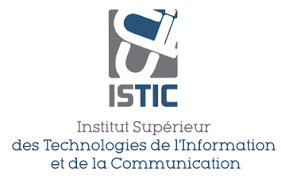

<p align="center">
    
</p>
<h1 align="center">
 <a href="https://mission.computer-engineering.tech/">Guide to Computer Engineering</a> 
</h1>

 


<div align="center">
    
## Connect with students
[](https://discord.gg/NE95VdWS8V)


## Important Directions
[Act and help others](https://forms.zohopublic.com/isticbc/form/Resources/formperma/1-4w1KAlQUkKxzvRsc2V688moUg8Ki1yM7fQVmrZpuQ?fbclid=IwAR1FDnq3LGfBSceGha03cWRwXUorw1WSEr_uuH7_egYI33ePVNUCJ0ylLJQ) <br>
[Open Source Materials](docs/ISTIC_Materials.md) <br>
[College Labs Starter](https://labs.computer-engineering.tech/)

# Contact us

| Overall Project              | Improve@computer-engineering.Tech                |
|:--------                     |:--------                    |
| **IOT Specific**               |  Yahya@computer-engineering.Tech                       |  
| **IRS Specific**             | Jawher.Smida@computer-engineering.Tech                    |


#### Developer

Pull The image from the [Dockerhub](https://hub.docker.com/r/yaya2devops/bachelor-guide).

```
docker run -d -p 8080:80 bachelor-guide
```


## Feedback
Please feel free to leave feedback in [issues](https://github.com/yaya2devops/bachelor-guide/issues)/[PRs](https://github.com/yaya2devops/bachelor-guide/pulls).

## LICENSE
Licensed under [MIT License](LICENSE).

 </div>

