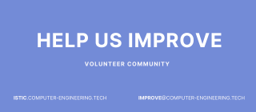
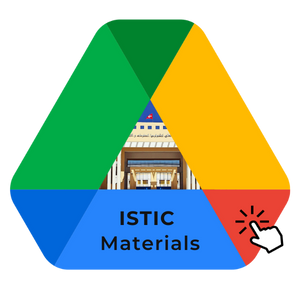

 
 
    

 
 

|          Find Others | Hands-on |   Contribute|
|:--------:  |:--------:  |:--------:  |
|     ||

---
 

|    Semester 1 |   Semester 2  |
|  :--------:     |:--------:   |
|                    |              | 
 

---

|    IOT 3               |   IOT 4          | IOT 5 |
|:--------:          |:--------:    |:--------:    |
|                  |              |      |

---

|    IRS 3               |   IRS 4          | IRS 5 |
|:--------:          |:--------:    |:--------:    |
|                  |              |        |

---

|  **Computer Science** | **LGLSI1&2:** ISTIC & ISI | LGLSI2nd| LGLSIT3rd|University FCB, INSAT, ISIMA, ISITCOM|
|:--------:                   | :--------:     | :--------:   | :--------:                    | :--------:    | 
|  | | |   |  |

---

|Books & Manuals|Other Projects|  Add Yours HERE|
| :--------:     | :--------:   | :--------:                    |
|[🖱PFE2022](https://drive.google.com/drive/folders/1DBWnLCZq-RNfXJa_IEVvRgq9ilqLpckW)  | [LGLSI](https://lglsi-3b.web.app/)|[Tell us ❗](welcome/hi.md#contributing) |

---

## Important Notice

<b>Read Before Continuing</b>

We are delighted to be able to provide  students with an ever-growing archive of materials that can help them in their studies. 

We hope and inspire to empower and give students like yourself more choice and autonomy when it comes to deciding which materials best fit their course curriculum. 
 

**Contribute your material in order to increase the overall value**.  

> Thank you to everyone who helped make this selection possible. 😊   Good luck!🍀

|[Get Internships](https://istic.computer-engineering.tech/#/intern)|[Start Issue](https://github.com/yaya2devops/bachelor-guide/issues/new?title=Let%20Us%20Know&body=%0A%0A%5BEnter%20feedback%20here%5D%0A%0A%0A---%0A%23%23%23%23%20Guide%20Details%0A%E2%9A%A0%20*Leave%20This%20section%20for%20GitHub%20and%20Guide%20issue%20redirections*%0A*%20ID%3A%20%5B7e2c0e6e-8b6d-4c2f-aaef-15f736a7b2a1%5D%0A*%20Version%20Independent%20ID%3A%20%5Ba5f1d387-7be9-4f0c-b92d-d52d16ef1d8e%5D%0A*%20Content%3A%20%5BBachelors%20in%20Computer%20Engineering%20Guide%5D%0A*%20Content%20Source%3A%20%5Bbachelor-guide/docs/README.md%5D(https://github.com/yaya2devops/bachelor-guide/blob/main/docs/README.md)%0A*%20Service%3A%20%5Bcollege-students-empower%5D%0A*%20GitHub%20Handle%3A%20%40yaya2devops)|
|---|---|

[For more information..](contributions.md)

---

