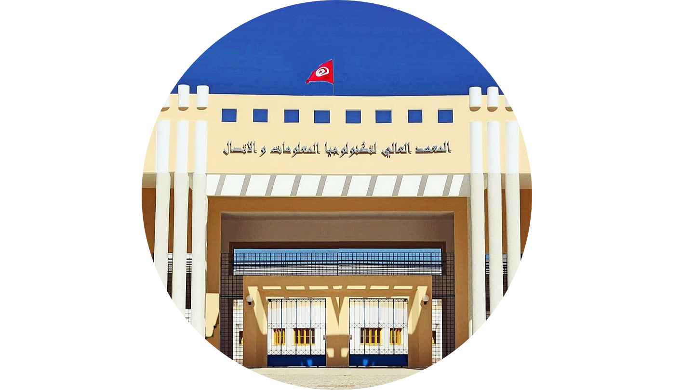
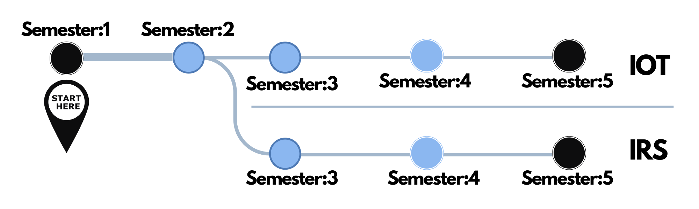

# Introduction
When considering a career in technology. This degree appears to be very precise. Including  a good foundation to computers from low-level hardware (assembly) to a widely used language like Python. Aside from helping with networking and embedded systems.

## Is it right for you?
This degree will introduce you to some of the amazing innovations that the world is constantly employing to provide value, say Web & Mobile Developement, Computer Architecture, Microcontroller programming, Cloud computing, software testing..
Although Computer Science appears to have received the most attention, this degree is actually equivalent in terms of knowledge provided.
 
If you want to help build the world we live in on a large scale, this is a good place to start.

# Path to options
After two semesters of success, the student should be able to choose between two specialties for the 3 semesters left.
- Network and Systems Engineering
- IOT & Embedded systems

## Mobile Experience

Take your studies with you wherever you go.  **Scan** the code below and try the mobile exposure.

