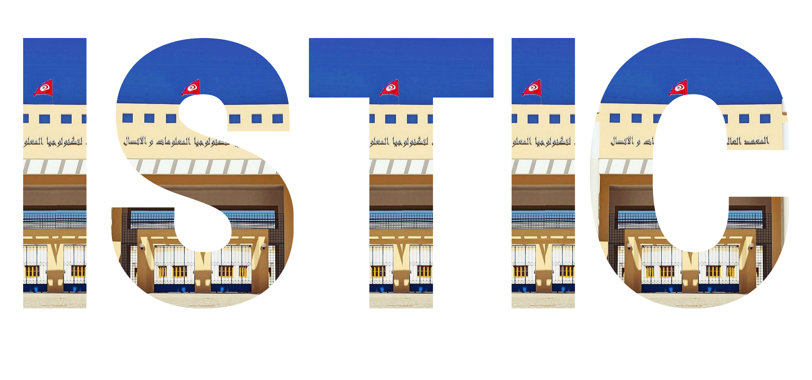
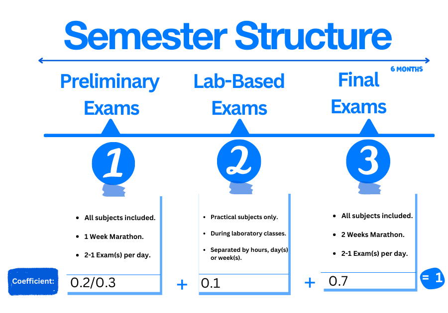

---

# Motivation
When considering about a career in Tech. This bachelor's appears to be extremely accurate. Including  a good **foundation** to computers from low-level hardware (**Assembly**) to a widely used language like **C, C++ & Python**. In addition to assisting with **networking**, scripting w/**Bash** & **security**.

This degree will introduce you to some of the incredible innovations that the world is constantly leveraging to provide value, such as Web & Mobile Development, Computer Architecture, Microcontroller programming, Cloud computing, and software testing..
Although Computer Science appears to have received the most attention, this degree is equivalent in terms of **knowledge provided**.

 

# Path to options
After two semesters of success, the student should be able to choose between two specialties for the 3 semesters left.
- IOT & Embedded systems
- Network and Systems Engineering

# Examining methodology

# Professional Experience

# Get Started
Each section will include usefull resources and content to assist you in excelling in your preparation and making the most of your education.
##### The documentation is structured as follows.
- **Mutual**
  - [Semester Ⅰ](Semester1/1.md )
  - [Semester Ⅱ](Semester2/2.md)
 
- **IOT & Embedded systems Speciality**
  - [Semester Ⅲ - IOT](Semester3-IOT/3.md)
  - [Semester Ⅳ - IOT](Semester4-IOT/4.md)
  - [Semester Ⅴ - IOT](Semester5-IOT/5.md)
- **Network and Systems Engineering Speciality** 
  - [Semester Ⅲ - IRS](Semester3-IRS/3.md)
  - [Semester Ⅳ - IRS](Semester4-IRS/4.md)
  - [Semester Ⅴ - IRS](Semester5-IRS/5.md)

## Mobile Experience

Take your studies with you wherever you go.  **Scan** the code below and try on mobiles.

