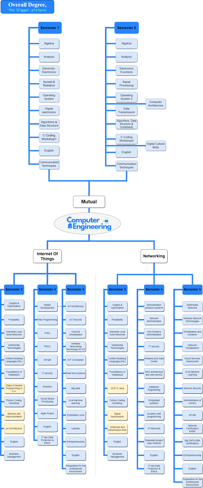

---

# Welcome
This site will serve as a support to the degree and an introduction to some of the incredible innovations that the world is constantly leveraging to provide value, such as Web, Mobile Development, Computer Architecture, Microcontroller programming, Cloud computing, and software testing. Although Computer Science appears to have received the most attention in recent years, this is equivalent in terms of knowledge provided.

# Degree Curriculum

## QR-Code for Mobiles

Take your studies with you wherever you go. **Scan** the code below and try on mobiles.

