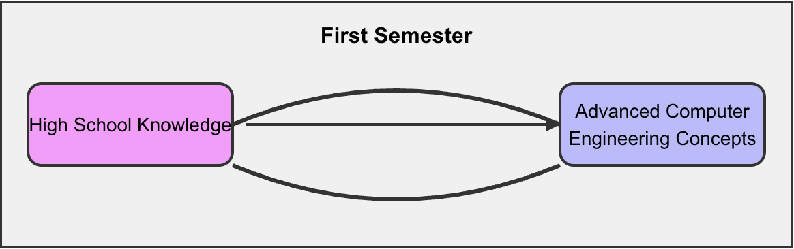
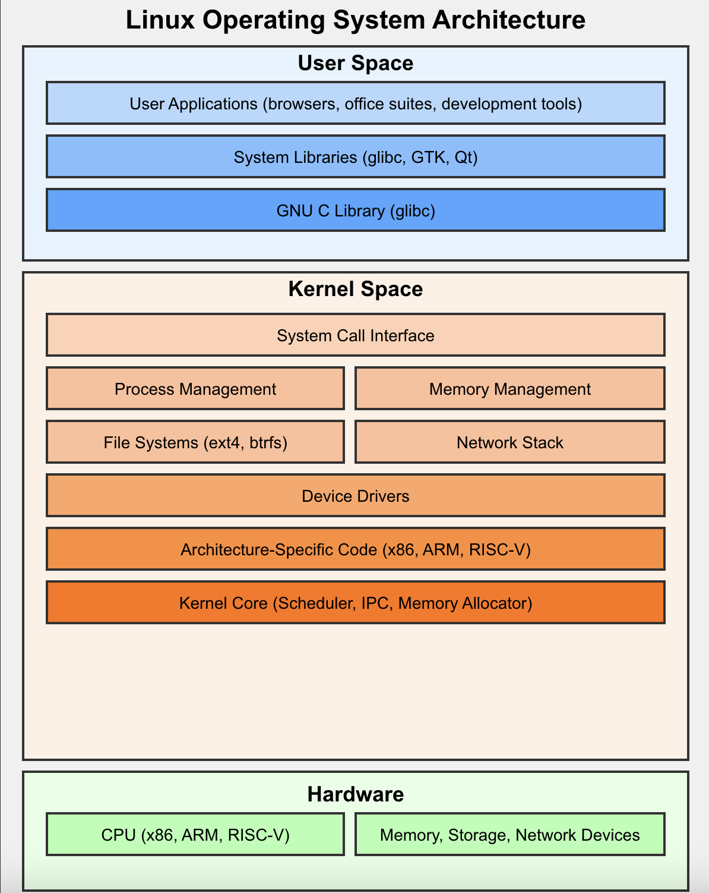

<br>

# Ⅰ - The Foundation of Your Journey

Welcome to the first semester of your computer engineering degree! This initial stage is crucial, laying the groundwork for your entire academic journey. It's designed to bridge the gap between your high school knowledge and the advanced concepts you'll encounter in the coming years.



> 🚀 **New students**: Check out our [orientation resources](https://drive.google.com/drive/folders/1crpJ7tOmzfah4LNG5JzkCSWoJVR7TTkM?usp=sharing) to get started on the right foot!

<details>
<summary>What to expect this semester</summary>

This semester is a thrilling dive into the world of computer engineering. You'll explore:

- The fundamentals of algorithms
- The versatile C programming language
- Fascinating physics theories
- Core computer principles
- Command line mastery
- Essential mathematical concepts

⚠️ **Note**: Many students find this semester challenging, but remember:

> "The expert in anything was once a beginner." - Helen Hayes

With [discipline](https://ffe.org/importance-of-discipline-newsletter-april-2022/#:~:text=Discipline%20creates%20habits%2C%20habits%20make,and%20to%20regulate%20our%20emotions.) and perseverance, you'll not only survive but thrive, setting a strong foundation for your future success in computer engineering.

</details>

## Semester at a Glance

Here's a breakdown of your subjects, their importance, and the practical tools you'll use:

| Teaching Unit | Subject | Coefficient | Credits | Practical Tools |
|:--------------|:--------|:-----------:|:-------:|:----------------|
| Mathematics I | [Algebra](#-algebra) | 1.5 | 3 | - |
| Mathematics I | [Analysis](#-analysis) | 1.5 | 3 | - |
| Physics I | [Electricity & Electronics](#-electricity-and-electronics) | 2 | 4 | ISIS |
| Physics I | [Spread & Radiation](#-spread-and-radiation) | 1 | 2 | - |
| Hard & Soft I | [Operating Systems](#-operating-system) | 2 | 4 | [Oracle VirtualBox](https://www.virtualbox.org/), [Ubuntu](https://ubuntu.com/download/desktop) |
| Hard & Soft I | [Digital Electronics](#-digital-electronics) | 1.5 | 3 | Proteus ISIS |
| Algorithms I | [Algorithms & Data Structures](#-algorithms-and-data-structures) | 2 | 4 | - |
| Programming I | [C Coding Workshop](#-c-coding-workshop-1) | 1.5 | 3 | [Dev-C++](https://sourceforge.net/projects/orwelldevcpp/), [Code::Blocks](https://www.codeblocks.org/downloads/) |
| Corporate Culture | [English](#-english) | 1 | 2 | - |
| Corporate Culture | [Communication Techniques](#-communication-techniques) | 1 | 2 | - |

## 📖 Algebra

Algebra is the language of mathematics and a cornerstone of computer engineering. It's not just about solving equations; it's about understanding patterns and relationships that underpin complex systems.

Key Topics:


<svg xmlns="http://www.w3.org/2000/svg" viewBox="0 0 300 200">
  <!-- Background -->
  <rect width="300" height="200" fill="#f0f0f0"/>
  
  <!-- Quadratic function graph -->
  <path d="M50,150 Q150,50 250,150" stroke="#4a90e2" stroke-width="3" fill="none"/>
  
  <!-- x and y axes -->
  <line x1="50" y1="10" x2="50" y2="190" stroke="black" stroke-width="2"/>
  <line x1="10" y1="150" x2="290" y2="150" stroke="black" stroke-width="2"/>
  
  <!-- Algebraic expressions -->
  <text x="60" y="40" font-family="Arial, sans-serif" font-size="14" fill="#333">
    f(x) = ax² + bx + c
  </text>
  
  <text x="200" y="100" font-family="Arial, sans-serif" font-size="14" fill="#333">
    Σ(n) = n(n+1)/2
  </text>
  
  <!-- Matrix representation -->
  <rect x="180" y="130" width="60" height="60" fill="none" stroke="#4a90e2" stroke-width="2"/>
  <line x1="200" y1="130" x2="200" y2="190" stroke="#4a90e2" stroke-width="1"/>
  <line x1="220" y1="130" x2="220" y2="190" stroke="#4a90e2" stroke-width="1"/>
  <line x1="180" y1="150" x2="240" y2="150" stroke="#4a90e2" stroke-width="1"/>
  <line x1="180" y1="170" x2="240" y2="170" stroke="#4a90e2" stroke-width="1"/>
  
  <!-- Greek letter (common in algebra) -->
  <text x="30" y="100" font-family="Arial, sans-serif" font-size="24" fill="#333">
    Δ
  </text>
</svg>


Applications: Algebra is crucial in various fields of computer engineering, including:

```
        Algebra
      /     |   \
Polynomials |   Linear
 Fractions  |   Algebra
         Vectors
```

- Cryptography
- Computer graphics
- Machine learning algorithms
- Quantum computing

## 📖 Analysis

Mathematical analysis forms the backbone of many computational processes. It's about understanding change, which is fundamental to how computers process information and how we model real-world phenomena.

Key Topics:
- Limits and continuity
- Derivation
- Integration (introduction)

<svg xmlns="http://www.w3.org/2000/svg" viewBox="0 0 300 200">
  <!-- Background -->
  <rect width="300" height="200" fill="#f0f0f0"/>
  
  <!-- Coordinate system -->
  <line x1="0" y1="100" x2="300" y2="100" stroke="black" stroke-width="1"/>
  <line x1="150" y1="0" x2="150" y2="200" stroke="black" stroke-width="1"/>
  
  <!-- Function with a jump discontinuity -->
  <path d="M50,150 L140,110 M160,90 L250,50" stroke="#4a90e2" stroke-width="2" fill="none"/>
  
  <!-- Limit arrows -->
  <path d="M145,105 L155,95" stroke="red" stroke-width="2" fill="none"/>
  <path d="M155,105 L145,95" stroke="red" stroke-width="2" fill="none"/>
  
  <!-- Point of discontinuity -->
  <circle cx="150" cy="110" r="3" fill="red"/>
  <circle cx="150" cy="90" r="3" fill="red"/>
  
  <!-- Labels -->
  <text x="160" y="30" font-family="Arial, sans-serif" font-size="12" fill="#333">y = f(x)</text>
  <text x="260" y="95" font-family="Arial, sans-serif" font-size="12" fill="#333">x</text>
  <text x="155" y="195" font-family="Arial, sans-serif" font-size="12" fill="#333">y</text>
  
  <!-- Limit notation -->
  <text x="10" y="30" font-family="Arial, sans-serif" font-size="14" fill="#333">
    lim f(x) ≠ f(a)
  </text>
  <text x="10" y="50" font-family="Arial, sans-serif" font-size="14" fill="#333">
    x→a
  </text>
  
  <!-- Epsilon-delta definition -->
  <text x="180" y="170" font-family="Arial, sans-serif" font-size="14" fill="#333">
    |f(x) - L| &lt; ε
  </text>
  <text x="180" y="190" font-family="Arial, sans-serif" font-size="14" fill="#333">
    when |x - a| &lt; δ
  </text>
</svg>

Applications:
- Optimizing algorithms
- Signal processing
- Computer vision
- Numerical simulations

## 📖 Electricity and Electronics

This course bridges the gap between physics and practical electronics, forming the basis of how computers physically operate.

<svg xmlns="http://www.w3.org/2000/svg" viewBox="0 0 400 300">
  <!-- Background -->
  <rect width="400" height="300" fill="#f0f0f0"/>
  
  <!-- DC Circuit -->
  <circle cx="50" cy="50" r="20" stroke="black" stroke-width="2" fill="none"/>
  <line x1="70" y1="50" x2="130" y2="50" stroke="black" stroke-width="2"/>
  <rect x="130" y="40" width="40" height="20" stroke="black" stroke-width="2" fill="none"/>
  <line x1="170" y1="50" x2="200" y2="50" stroke="black" stroke-width="2"/>
  <path d="M 30 50 L 40 50 M 35 45 L 35 55" stroke="black" stroke-width="2"/>
  <text x="35" y="80" font-family="Arial, sans-serif" font-size="12" text-anchor="middle">DC</text>
  
  <!-- AC Waveform -->
  <path d="M 220 50 Q 240 10 260 50 T 300 50" stroke="#4a90e2" stroke-width="2" fill="none"/>
  <text x="260" y="80" font-family="Arial, sans-serif" font-size="12" text-anchor="middle">AC</text>
  
  <!-- Sinusoidal Power -->
  <path d="M 50 150 Q 70 110 90 150 T 130 150" stroke="#4a90e2" stroke-width="2" fill="none"/>
  <path d="M 50 150 Q 70 190 90 150 T 130 150" stroke="#ff7f0e" stroke-width="2" fill="none"/>
  <text x="90" y="180" font-family="Arial, sans-serif" font-size="12" text-anchor="middle">Sinusoidal Power</text>
  
  <!-- Transient Analysis -->
  <path d="M 220 150 L 240 150 L 240 120 Q 260 120 260 150 L 300 150" stroke="#2ca02c" stroke-width="2" fill="none"/>
  <text x="260" y="180" font-family="Arial, sans-serif" font-size="12" text-anchor="middle">Transient Response</text>
  
  <!-- High-pass Filter -->
  <line x1="50" y1="250" x2="70" y2="250" stroke="black" stroke-width="2"/>
  <rect x="70" y="240" width="20" height="20" stroke="black" stroke-width="2" fill="none"/>
  <circle cx="110" cy="250" r="10" stroke="black" stroke-width="2" fill="none"/>
  <line x1="120" y1="250" x2="140" y2="250" stroke="black" stroke-width="2"/>
  <path d="M 140 250 Q 160 250 160 230 L 180 230" stroke="#d62728" stroke-width="2" fill="none"/>
  <text x="115" y="280" font-family="Arial, sans-serif" font-size="12" text-anchor="middle">High-pass Filter</text>
  
  <!-- Low-pass Filter -->
  <line x1="220" y1="250" x2="240" y2="250" stroke="black" stroke-width="2"/>
  <circle cx="260" cy="250" r="10" stroke="black" stroke-width="2" fill="none"/>
  <rect x="280" y="240" width="20" height="20" stroke="black" stroke-width="2" fill="none"/>
  <line x1="300" y1="250" x2="320" y2="250" stroke="black" stroke-width="2"/>
  <path d="M 320 250 Q 340 250 340 270 L 360 270" stroke="#9467bd" stroke-width="2" fill="none"/>
  <text x="290" y="280" font-family="Arial, sans-serif" font-size="12" text-anchor="middle">Low-pass Filter</text>
</svg>


Key Topics:
- Introduction to electricity and its history
- DC and AC circuits
- Sinusoidal power
- Transient analysis
- Filter design (High-pass and Low-pass)

```
    +---[R]---+
    |         |
 [Voltage]    |
    |         |
    +----[C]--+
    
 [R] = Resistor
 [C] = Capacitor
```

Applications:
- Microprocessor design
- Power management in devices
- Sensor interfaces
- Communication systems

## 📖 Spread And Radiation

This course explores the physics behind wireless communication, a cornerstone of modern computing and networking.

<svg xmlns="http://www.w3.org/2000/svg" viewBox="0 0 400 300">
  <!-- Background -->
  <rect width="400" height="300" fill="#f0f0f0"/>
  
  <!-- Vector Calculus -->
  <g transform="translate(50,50)">
    <!-- Coordinate system -->
    <line x1="0" y1="50" x2="100" y2="50" stroke="black" stroke-width="1"/>
    <line x1="50" y1="0" x2="50" y2="100" stroke="black" stroke-width="1"/>
    <text x="95" y="65" font-family="Arial, sans-serif" font-size="10">x</text>
    <text x="35" y="15" font-family="Arial, sans-serif" font-size="10">y</text>
    
    <!-- Vector field representation -->
    <line x1="25" y1="25" x2="40" y2="35" stroke="blue" stroke-width="1.5" marker-end="url(#arrowhead)"/>
    <line x1="75" y1="25" x2="60" y2="35" stroke="blue" stroke-width="1.5" marker-end="url(#arrowhead)"/>
    <line x1="25" y1="75" x2="40" y2="65" stroke="blue" stroke-width="1.5" marker-end="url(#arrowhead)"/>
    <line x1="75" y1="75" x2="60" y2="65" stroke="blue" stroke-width="1.5" marker-end="url(#arrowhead)"/>
    
    <text x="50" y="115" font-family="Arial, sans-serif" font-size="12" text-anchor="middle">Vector Field</text>
  </g>
  
  <!-- Maxwell's Equations -->
  <g transform="translate(200,20)">
    <text x="0" y="20" font-family="Arial, sans-serif" font-size="12">Maxwell's Equations:</text>
    <text x="10" y="40" font-family="Arial, sans-serif" font-size="10">∇ · E = ρ/ε₀</text>
    <text x="10" y="60" font-family="Arial, sans-serif" font-size="10">∇ · B = 0</text>
    <text x="10" y="80" font-family="Arial, sans-serif" font-size="10">∇ × E = -∂B/∂t</text>
    <text x="10" y="100" font-family="Arial, sans-serif" font-size="10">∇ × B = μ₀(J + ε₀∂E/∂t)</text>
  </g>
  
  <!-- Electromagnetic Wave -->
  <g transform="translate(50,180)">
    <!-- Wave representation -->
    <path d="M 0 50 Q 25 0 50 50 T 100 50 T 150 50 T 200 50 T 250 50 T 300 50" fill="none" stroke="red" stroke-width="2"/>
    <path d="M 0 50 Q 25 100 50 50 T 100 50 T 150 50 T 200 50 T 250 50 T 300 50" fill="none" stroke="blue" stroke-width="2"/>
    
    <!-- Labels -->
    <text x="150" y="20" font-family="Arial, sans-serif" font-size="12" text-anchor="middle" fill="red">E (Electric Field)</text>
    <text x="150" y="95" font-family="Arial, sans-serif" font-size="12" text-anchor="middle" fill="blue">B (Magnetic Field)</text>
    <text x="150" y="115" font-family="Arial, sans-serif" font-size="12" text-anchor="middle">Electromagnetic Wave in Vacuum</text>
    
    <!-- Direction arrow -->
    <line x1="0" y1="50" x2="300" y2="50" stroke="black" stroke-width="1" marker-end="url(#arrowhead)"/>
    <text x="290" y="65" font-family="Arial, sans-serif" font-size="10">Direction of Propagation</text>
  </g>
  
  <!-- Arrow marker definition -->
  <defs>
    <marker id="arrowhead" markerWidth="10" markerHeight="7" refX="0" refY="3.5" orient="auto">
      <polygon points="0 0, 10 3.5, 0 7" />
    </marker>
  </defs>
</svg>

Key Topics:
- Vector calculus essentials
- Maxwell's equations
- Electromagnetic waves in vacuum

```
      Electric Field
         ^
         |    /
         |   /
         |  /
         | /  Electromagnetic
         |/   Wave
---------|----------->
         |\   Direction of
         | \  Propagation
         |  \
         |   \
         |    v
      Magnetic Field
```

Applications:
- Wi-Fi and cellular networks
- Satellite communications
- Remote sensing
- Antenna design

## 📖 Operating System

Operating systems are the backbone of all computer operations.

<svg xmlns="http://www.w3.org/2000/svg" viewBox="0 0 400 300">
  <!-- Background -->
  <rect width="400" height="300" fill="#f0f0f0"/>
  
  <!-- UNIX Foundational Concepts -->
  <g transform="translate(10,10)">
    <text x="0" y="15" font-family="Arial, sans-serif" font-size="12" font-weight="bold">UNIX Concepts:</text>
    <text x="10" y="35" font-family="Arial, sans-serif" font-size="10">- Everything is a file</text>
    <text x="10" y="50" font-family="Arial, sans-serif" font-size="10">- Modular design</text>
    <text x="10" y="65" font-family="Arial, sans-serif" font-size="10">- Multi-user/Multi-tasking</text>
  </g>
  
  <!-- Linux Basic Commands -->
  <g transform="translate(200,10)">
    <text x="0" y="15" font-family="Arial, sans-serif" font-size="12" font-weight="bold">Linux Commands:</text>
    <text x="10" y="35" font-family="Arial, sans-serif" font-size="10">$ ls -l</text>
    <text x="10" y="50" font-family="Arial, sans-serif" font-size="10">$ cd /home</text>
    <text x="10" y="65" font-family="Arial, sans-serif" font-size="10">$ ps aux</text>
    <text x="10" y="80" font-family="Arial, sans-serif" font-size="10">$ chmod 755 file.txt</text>
  </g>
  
  <!-- Layered Architecture -->
  <g transform="translate(10,100)">
    <text x="70" y="0" font-family="Arial, sans-serif" font-size="12" font-weight="bold">Layered Architecture</text>
    <rect x="0" y="10" width="140" height="30" fill="#ff9999" stroke="black"/>
    <text x="70" y="30" font-family="Arial, sans-serif" font-size="10" text-anchor="middle">User Applications</text>
    <rect x="0" y="40" width="140" height="30" fill="#99ff99" stroke="black"/>
    <text x="70" y="60" font-family="Arial, sans-serif" font-size="10" text-anchor="middle">System Libraries</text>
    <rect x="0" y="70" width="140" height="30" fill="#9999ff" stroke="black"/>
    <text x="70" y="90" font-family="Arial, sans-serif" font-size="10" text-anchor="middle">Kernel</text>
    <rect x="0" y="100" width="140" height="30" fill="#ffff99" stroke="black"/>
    <text x="70" y="120" font-family="Arial, sans-serif" font-size="10" text-anchor="middle">Hardware</text>
  </g>
  
  <!-- Process Scheduling -->
  <g transform="translate(200,100)">
    <text x="70" y="0" font-family="Arial, sans-serif" font-size="12" font-weight="bold">Process Scheduling</text>
    <circle cx="40" cy="40" r="20" fill="#ff9999" stroke="black"/>
    <text x="40" y="45" font-family="Arial, sans-serif" font-size="10" text-anchor="middle">P1</text>
    <circle cx="100" cy="40" r="20" fill="#99ff99" stroke="black"/>
    <text x="100" y="45" font-family="Arial, sans-serif" font-size="10" text-anchor="middle">P2</text>
    <circle cx="70" cy="90" r="20" fill="#9999ff" stroke="black"/>
    <text x="70" y="95" font-family="Arial, sans-serif" font-size="10" text-anchor="middle">P3</text>
    <path d="M 60 40 A 30 30 0 0 1 90 70" fill="none" stroke="black" stroke-width="2" marker-end="url(#arrowhead)"/>
    <text x="70" y="120" font-family="Arial, sans-serif" font-size="10" text-anchor="middle">Round Robin</text>
  </g>
  
  <!-- Memory Management -->
  <g transform="translate(10,240)">
    <text x="190" y="0" font-family="Arial, sans-serif" font-size="12" font-weight="bold">Memory Management</text>
    <rect x="0" y="10" width="380" height="40" fill="#e6e6e6" stroke="black"/>
    <rect x="0" y="10" width="80" height="40" fill="#ff9999" stroke="black"/>
    <text x="40" y="35" font-family="Arial, sans-serif" font-size="10" text-anchor="middle">OS Kernel</text>
    <rect x="80" y="10" width="60" height="40" fill="#99ff99" stroke="black"/>
    <text x="110" y="35" font-family="Arial, sans-serif" font-size="10" text-anchor="middle">P1</text>
    <rect x="140" y="10" width="100" height="40" fill="#9999ff" stroke="black"/>
    <text x="190" y="35" font-family="Arial, sans-serif" font-size="10" text-anchor="middle">Free Memory</text>
    <rect x="240" y="10" width="80" height="40" fill="#ffff99" stroke="black"/>
    <text x="280" y="35" font-family="Arial, sans-serif" font-size="10" text-anchor="middle">P2</text>
    <rect x="320" y="10" width="60" height="40" fill="#ff99ff" stroke="black"/>
    <text x="350" y="35" font-family="Arial, sans-serif" font-size="10" text-anchor="middle">P3</text>
  </g>
  
  <!-- Arrow marker definition -->
  <defs>
    <marker id="arrowhead" markerWidth="10" markerHeight="7" refX="0" refY="3.5" orient="auto">
      <polygon points="0 0, 10 3.5, 0 7" />
    </marker>
  </defs>
</svg>

Managing hardware resources and providing services for computer programs.


Key Topics:
- UNIX foundational concepts
- Linux basic commands
- Layered architecture
- Process scheduling
- Memory management


<svg xmlns="http://www.w3.org/2000/svg" viewBox="0 0 800 600">
  <defs>
    <marker id="arrowhead" markerWidth="10" markerHeight="7" refX="0" refY="3.5" orient="auto">
      <polygon points="0 0, 10 3.5, 0 7" fill="#333"/>
    </marker>
  </defs>
  
  <!-- Background -->
  <rect width="800" height="600" fill="#f0f0f0"/>
  
  <!-- User Layer -->
  <g transform="translate(350, 20)">
    <circle cx="50" cy="50" r="40" fill="#FFD700"/>
    <text x="50" y="55" font-family="Arial, sans-serif" font-size="14" text-anchor="middle"></text>
    <path d="M30,35 Q50,20 70,35 Q60,50 50,55 Q40,50 30,35" fill="#333"/>
    <circle cx="45" cy="38" r="3" fill="#FFF"/>
    <circle cx="55" cy="38" r="3" fill="#FFF"/>
  </g>
  
  <!-- Application Software Layer -->
  <g transform="translate(200, 150)">
    <rect x="0" y="0" width="400" height="80" rx="10" fill="#87CEEB"/>
    <text x="200" y="45" font-family="Arial, sans-serif" font-size="18" font-weight="bold" text-anchor="middle">Application Software</text>
    <rect x="20" y="20" width="40" height="40" fill="#FFF"/>
    <rect x="340" y="20" width="40" height="40" fill="#FFF"/>
    <line x1="30" y1="30" x2="50" y2="30" stroke="#87CEEB" stroke-width="2"/>
    <line x1="30" y1="40" x2="50" y2="40" stroke="#87CEEB" stroke-width="2"/>
    <line x1="30" y1="50" x2="50" y2="50" stroke="#87CEEB" stroke-width="2"/>
    <line x1="350" y1="30" x2="370" y2="30" stroke="#87CEEB" stroke-width="2"/>
    <line x1="350" y1="40" x2="370" y2="40" stroke="#87CEEB" stroke-width="2"/>
    <line x1="350" y1="50" x2="370" y2="50" stroke="#87CEEB" stroke-width="2"/>
  </g>
  
  <!-- Operating System Layer -->
  <g transform="translate(100, 280)">
    <rect x="0" y="0" width="600" height="100" rx="10" fill="#98FB98"/>
    <text x="300" y="35" font-family="Arial, sans-serif" font-size="22" font-weight="bold" text-anchor="middle">Operating System</text>
    <line x1="50" y1="50" x2="550" y2="50" stroke="#333" stroke-width="2" stroke-dasharray="5,5"/>
    <text x="70" y="80" font-family="Arial, sans-serif" font-size="14">Kernel</text>
    <text x="200" y="80" font-family="Arial, sans-serif" font-size="14">System Calls</text>
    <text x="350" y="80" font-family="Arial, sans-serif" font-size="14">Libraries</text>
    <text x="480" y="80" font-family="Arial, sans-serif" font-size="14">Utilities</text>
  </g>
  
  <!-- OS Components -->
  <g transform="translate(50, 420)">
    <rect x="0" y="0" width="140" height="60" rx="5" fill="#FF6347"/>
    <text x="70" y="35" font-family="Arial, sans-serif" font-size="14" text-anchor="middle">Process</text>
    <text x="70" y="55" font-family="Arial, sans-serif" font-size="14" text-anchor="middle">Management</text>
  </g>
  
  <g transform="translate(230, 420)">
    <rect x="0" y="0" width="140" height="60" rx="5" fill="#FF6347"/>
    <text x="70" y="35" font-family="Arial, sans-serif" font-size="14" text-anchor="middle">Memory</text>
    <text x="70" y="55" font-family="Arial, sans-serif" font-size="14" text-anchor="middle">Management</text>
  </g>
  
  <g transform="translate(410, 420)">
    <rect x="0" y="0" width="140" height="60" rx="5" fill="#FF6347"/>
    <text x="70" y="35" font-family="Arial, sans-serif" font-size="14" text-anchor="middle">File</text>
    <text x="70" y="55" font-family="Arial, sans-serif" font-size="14" text-anchor="middle">System</text>
  </g>
  
  <g transform="translate(590, 420)">
    <rect x="0" y="0" width="140" height="60" rx="5" fill="#FF6347"/>
    <text x="70" y="35" font-family="Arial, sans-serif" font-size="14" text-anchor="middle">Device</text>
    <text x="70" y="55" font-family="Arial, sans-serif" font-size="14" text-anchor="middle">Drivers</text>
  </g>
  
  <!-- Hardware Layer -->
  <g transform="translate(200, 520)">
    <rect x="0" y="0" width="400" height="60" rx="10" fill="#C0C0C0"/>
    <text x="200" y="38" font-family="Arial, sans-serif" font-size="18" font-weight="bold" text-anchor="middle">Hardware</text>
    <circle cx="50" cy="30" r="15" fill="#333"/>
    <circle cx="350" cy="30" r="15" fill="#333"/>
    <rect x="90" y="20" width="220" height="20" fill="#333" rx="5"/>
  </g>
  
  <!-- Connections -->
  <line x1="400" y1="110" x2="400" y2="150" stroke="#333" stroke-width="2" marker-end="url(#arrowhead)"/>
  <line x1="400" y1="230" x2="400" y2="280" stroke="#333" stroke-width="2" marker-end="url(#arrowhead)"/>
  <line x1="400" y1="380" x2="400" y2="420" stroke="#333" stroke-width="2" marker-end="url(#arrowhead)"/>
  <line x1="120" y1="380" x2="120" y2="420" stroke="#333" stroke-width="2" marker-end="url(#arrowhead)"/>
  <line x1="300" y1="380" x2="300" y2="420" stroke="#333" stroke-width="2" marker-end="url(#arrowhead)"/>
  <line x1="480" y1="380" x2="480" y2="420" stroke="#333" stroke-width="2" marker-end="url(#arrowhead)"/>
  <line x1="660" y1="380" x2="660" y2="420" stroke="#333" stroke-width="2" marker-end="url(#arrowhead)"/>
  <line x1="400" y1="480" x2="400" y2="520" stroke="#333" stroke-width="2" marker-end="url(#arrowhead)"/>
</svg>

Practical: You'll use Oracle VirtualBox to run Ubuntu, giving you hands-on experience with a real Linux environment.





Above are layers in the operating system, you should be aware of.

## 📖 Digital Electronics

Digital electronics is the foundation of all modern computing devices, from smartphones to supercomputers.

<svg xmlns="http://www.w3.org/2000/svg" viewBox="0 0 600 500">
  <!-- Background -->
  <rect width="600" height="500" fill="#f0f0f0"/>
  
  <!-- Number Systems -->
  <g transform="translate(20,20)">
    <text x="0" y="20" font-family="Arial, sans-serif" font-size="16" font-weight="bold">Number Systems:</text>
    <text x="20" y="50" font-family="Arial, sans-serif" font-size="14">Decimal: 42</text>
    <text x="20" y="75" font-family="Arial, sans-serif" font-size="14">Binary: 101010</text>
    <text x="20" y="100" font-family="Arial, sans-serif" font-size="14">Hexadecimal: 2A</text>
  </g>
  
  <!-- Boolean Algebra -->
  <g transform="translate(320,20)">
    <text x="0" y="20" font-family="Arial, sans-serif" font-size="16" font-weight="bold">Boolean Algebra:</text>
    <text x="20" y="50" font-family="Arial, sans-serif" font-size="14">A · (B + C) = A·B + A·C</text>
    <text x="20" y="75" font-family="Arial, sans-serif" font-size="14">A + A' = 1</text>
    <text x="20" y="100" font-family="Arial, sans-serif" font-size="14">A · A = A</text>
  </g>
  
  <!-- Logic Gates -->
  <g transform="translate(20,140)">
    <text x="120" y="20" font-family="Arial, sans-serif" font-size="16" font-weight="bold">Logic Gates</text>
    <!-- AND Gate -->
    <path d="M20,40 Q50,40 50,65 Q50,90 20,90 Z" stroke="black" fill="none" stroke-width="2"/>
    <line x1="0" y1="50" x2="20" y2="50" stroke="black" stroke-width="2"/>
    <line x1="0" y1="80" x2="20" y2="80" stroke="black" stroke-width="2"/>
    <line x1="50" y1="65" x2="70" y2="65" stroke="black" stroke-width="2"/>
    <text x="35" y="110" font-family="Arial, sans-serif" font-size="14" text-anchor="middle">AND</text>
    <!-- OR Gate -->
    <path d="M100,40 Q150,40 135,65 Q150,90 100,90 Q115,65 100,40 Z" stroke="black" fill="none" stroke-width="2"/>
    <line x1="80" y1="50" x2="100" y2="50" stroke="black" stroke-width="2"/>
    <line x1="80" y1="80" x2="100" y2="80" stroke="black" stroke-width="2"/>
    <line x1="135" y1="65" x2="155" y2="65" stroke="black" stroke-width="2"/>
    <text x="117" y="110" font-family="Arial, sans-serif" font-size="14" text-anchor="middle">OR</text>
    <!-- NOT Gate -->
    <path d="M185,45 L185,85 L215,65 Z" stroke="black" fill="none" stroke-width="2"/>
    <circle cx="218" cy="65" r="3" fill="black"/>
    <line x1="165" y1="65" x2="185" y2="65" stroke="black" stroke-width="2"/>
    <line x1="221" y1="65" x2="241" y2="65" stroke="black" stroke-width="2"/>
    <text x="203" y="110" font-family="Arial, sans-serif" font-size="14" text-anchor="middle">NOT</text>
  </g>
  
  <!-- Flip-Flop -->
  <g transform="translate(320,140)">
    <text x="100" y="20" font-family="Arial, sans-serif" font-size="16" font-weight="bold">D Flip-Flop</text>
    <rect x="30" y="40" width="140" height="80" fill="none" stroke="black" stroke-width="2"/>
    <text x="50" y="80" font-family="Arial, sans-serif" font-size="18">D</text>
    <text x="50" y="110" font-family="Arial, sans-serif" font-size="18">CLK</text>
    <text x="150" y="80" font-family="Arial, sans-serif" font-size="18">Q</text>
    <line x1="0" y1="70" x2="30" y2="70" stroke="black" stroke-width="2"/>
    <line x1="0" y1="100" x2="30" y2="100" stroke="black" stroke-width="2"/>
    <line x1="170" y1="70" x2="200" y2="70" stroke="black" stroke-width="2"/>
    <text x="100" y="140" font-family="Arial, sans-serif" font-size="14" text-anchor="middle">Memory Element</text>
  </g>
  
  <!-- Counter -->
  <g transform="translate(20,280)">
    <text x="80" y="20" font-family="Arial, sans-serif" font-size="16" font-weight="bold">4-Bit Counter</text>
    <rect x="20" y="40" width="160" height="80" fill="none" stroke="black" stroke-width="2"/>
    <text x="100" y="85" font-family="Arial, sans-serif" font-size="18" text-anchor="middle">Counter</text>
    <line x1="0" y1="70" x2="20" y2="70" stroke="black" stroke-width="2"/>
    <text x="10" y="65" font-family="Arial, sans-serif" font-size="14" text-anchor="middle">CLK</text>
    <line x1="180" y1="50" x2="200" y2="50" stroke="black" stroke-width="2"/>
    <line x1="180" y1="65" x2="200" y2="65" stroke="black" stroke-width="2"/>
    <line x1="180" y1="80" x2="200" y2="80" stroke="black" stroke-width="2"/>
    <line x1="180" y1="95" x2="200" y2="95" stroke="black" stroke-width="2"/>
    <text x="190" y="110" font-family="Arial, sans-serif" font-size="14" text-anchor="middle">Q0-Q3</text>
  </g>
  
  <!-- Multiplexer -->
  <g transform="translate(320,280)">
    <text x="100" y="20" font-family="Arial, sans-serif" font-size="16" font-weight="bold">4:1 Multiplexer</text>
    <path d="M50,40 L170,40 L170,120 L110,150 L50,120 Z" fill="none" stroke="black" stroke-width="2"/>
    <line x1="30" y1="55" x2="50" y2="55" stroke="black" stroke-width="2"/>
    <line x1="30" y1="85" x2="50" y2="85" stroke="black" stroke-width="2"/>
    <line x1="30" y1="115" x2="50" y2="115" stroke="black" stroke-width="2"/>
    <line x1="30" y1="145" x2="50" y2="145" stroke="black" stroke-width="2"/>
    <line x1="110" y1="150" x2="110" y2="170" stroke="black" stroke-width="2"/>
    <line x1="90" y1="150" x2="90" y2="170" stroke="black" stroke-width="2"/>
    <line x1="170" y1="80" x2="190" y2="80" stroke="black" stroke-width="2"/>
    <text x="25" y="155" font-family="Arial, sans-serif" font-size="14" text-anchor="end">I0-I3</text>
    <text x="100" y="185" font-family="Arial, sans-serif" font-size="14" text-anchor="middle">S0-S1</text>
    <text x="195" y="85" font-family="Arial, sans-serif" font-size="14">Out</text>
  </g>
  
  <!-- Arithmetic Circuit -->

</svg>

Key Topics:
- Number systems (binary, hexadecimal)
- Boolean algebra
- Logic gates and circuits
- Flip-flops and memory
- Counters and registers
- Multiplexers and demultiplexers
- Arithmetic circuits

```
   AND Gate       OR Gate        NOT Gate
    
    A--\           A--\           A--|>o--
       )--Y           \           
    B--/              )--Y
               B--/
```

Practical: You'll use Proteus ISIS for circuit simulation, allowing you to design and test digital circuits virtually.


## 📖 Algorithms And Data Structures

Algorithms and data structures are the building blocks of efficient software. They determine how problems are solved and how information is organized in computer systems.

<svg xmlns="http://www.w3.org/2000/svg" viewBox="0 0 500 600">
  <!-- Background -->
  <rect width="500" height="600" fill="#f0f0f0"/>
  
  <!-- Basic Data Structures -->
  <g transform="translate(10,10)">
    <text x="0" y="15" font-family="Arial, sans-serif" font-size="14" font-weight="bold">Basic Data Structures:</text>
    <!-- Array -->
    <rect x="10" y="25" width="200" height="30" fill="none" stroke="black"/>
    <line x1="50" y1="25" x2="50" y2="55" stroke="black"/>
    <line x1="90" y1="25" x2="90" y2="55" stroke="black"/>
    <line x1="130" y1="25" x2="130" y2="55" stroke="black"/>
    <line x1="170" y1="25" x2="170" y2="55" stroke="black"/>
    <text x="110" y="70" font-family="Arial, sans-serif" font-size="12" text-anchor="middle">Array</text>
    <!-- Linked List -->
    <rect x="10" y="90" width="40" height="30" fill="none" stroke="black"/>
    <rect x="90" y="90" width="40" height="30" fill="none" stroke="black"/>
    <rect x="170" y="90" width="40" height="30" fill="none" stroke="black"/>
    <line x1="50" y1="105" x2="90" y2="105" stroke="black" marker-end="url(#arrowhead)"/>
    <line x1="130" y1="105" x2="170" y2="105" stroke="black" marker-end="url(#arrowhead)"/>
    <text x="110" y="135" font-family="Arial, sans-serif" font-size="12" text-anchor="middle">Linked List</text>
  </g>
  
  <!-- Conditional and Iterative Structures -->
  <g transform="translate(250,10)">
    <text x="0" y="15" font-family="Arial, sans-serif" font-size="14" font-weight="bold">Control Structures:</text>
    <!-- If-Else -->
    <path d="M20,40 L50,70 L20,100 L-10,70 Z" fill="none" stroke="black"/>
    <text x="20" y="120" font-family="Arial, sans-serif" font-size="12" text-anchor="middle">If-Else</text>
    <!-- Loop -->
    <circle cx="120" cy="70" r="30" fill="none" stroke="black"/>
    <path d="M120,40 L135,55 L120,70 L105,55 Z" fill="black"/>
    <text x="120" y="120" font-family="Arial, sans-serif" font-size="12" text-anchor="middle">Loop</text>
  </g>
  
  <!-- Subroutines and Modularity -->
  <g transform="translate(10,180)">
    <text x="100" y="0" font-family="Arial, sans-serif" font-size="14" font-weight="bold">Subroutines and Modularity</text>
    <rect x="10" y="10" width="180" height="60" fill="none" stroke="black"/>
    <text x="100" y="45" font-family="Arial, sans-serif" font-size="14" text-anchor="middle">Main Program</text>
    <rect x="60" y="100" width="80" height="40" fill="none" stroke="black"/>
    <text x="100" y="125" font-family="Arial, sans-serif" font-size="12" text-anchor="middle">Subroutine</text>
    <line x1="100" y1="70" x2="100" y2="100" stroke="black" stroke-dasharray="5,5"/>
  </g>
  
  <!-- Sorting and Searching Algorithms -->
  <g transform="translate(250,180)">
    <text x="100" y="0" font-family="Arial, sans-serif" font-size="14" font-weight="bold">Sorting and Searching</text>
    <rect x="10" y="10" width="180" height="30" fill="none" stroke="black"/>
    <text x="100" y="30" font-family="Arial, sans-serif" font-size="12" text-anchor="middle">5 2 8 12 1 6</text>
    <path d="M100,40 L100,70" stroke="black" marker-end="url(#arrowhead)"/>
    <rect x="10" y="80" width="180" height="30" fill="none" stroke="black"/>
    <text x="100" y="100" font-family="Arial, sans-serif" font-size="12" text-anchor="middle">1 2 5 6 8 12</text>
    <text x="100" y="130" font-family="Arial, sans-serif" font-size="12" text-anchor="middle">Sorting Algorithm</text>
  </g>
  
  <!-- Recursion -->
  <g transform="translate(10,350)">
    <text x="100" y="0" font-family="Arial, sans-serif" font-size="14" font-weight="bold">Recursion</text>
    <rect x="30" y="10" width="140" height="40" fill="none" stroke="black"/>
    <text x="100" y="35" font-family="Arial, sans-serif" font-size="12" text-anchor="middle">Function</text>
    <path d="M100,50 C100,80 150,80 150,110" stroke="black" fill="none" marker-end="url(#arrowhead)"/>
    <path d="M150,110 C150,140 100,140 100,170" stroke="black" fill="none" marker-end="url(#arrowhead)"/>
    <rect x="30" y="170" width="140" height="40" fill="none" stroke="black"/>
    <text x="100" y="195" font-family="Arial, sans-serif" font-size="12" text-anchor="middle">Function (Recursive Call)</text>
  </g>
  
  <!-- Pointers and Memory Management -->
  <g transform="translate(250,350)">
    <text x="100" y="0" font-family="Arial, sans-serif" font-size="14" font-weight="bold">Pointers and Memory</text>
    <rect x="10" y="20" width="80" height="30" fill="none" stroke="black"/>
    <text x="50" y="40" font-family="Arial, sans-serif" font-size="12" text-anchor="middle">Pointer</text>
    <rect x="140" y="20" width="80" height="30" fill="none" stroke="black"/>
    <text x="180" y="40" font-family="Arial, sans-serif" font-size="12" text-anchor="middle">Data</text>
    <line x1="90" y1="35" x2="140" y2="35" stroke="black" marker-end="url(#arrowhead)"/>
    <rect x="10" y="80" width="210" height="80" fill="none" stroke="black"/>
    <text x="115" y="125" font-family="Arial, sans-serif" font-size="14" text-anchor="middle">Memory</text>
    <line x1="50" y1="50" x2="50" y2="80" stroke="black" stroke-dasharray="5,5"/>
    <line x1="180" y1="50" x2="180" y2="80" stroke="black" stroke-dasharray="5,5"/>
  </g>
  
  <!-- Arrow marker definition -->
  <defs>
    <marker id="arrowhead" markerWidth="10" markerHeight="7" refX="0" refY="3.5" orient="auto">
      <polygon points="0 0, 10 3.5, 0 7" />
    </marker>
  </defs>
</svg>

Key Topics:
- Basic data structures (arrays, linked lists, stacks, queues)
- Conditional and iterative structures
- Subroutines and modularity
- Sorting and searching algorithms
- Recursion
- Pointers and memory management

```
    Algorithm Complexity
       |
   +---+---+---+---+---+
   |   |   |   |   |   |
 O(1) O(log n) O(n) O(n log n) O(n²) O(2ⁿ)
Constant  |   Linear  |    Quadratic |
      Logarithmic   Linearithmic   Exponential
```

Practical: You'll implement these concepts in C, giving you a deep understanding of how they work at a low level.

## 📖 C Coding Workshop 1

C is a powerful and flexible language that forms the basis for many other programming languages and operating systems.

<svg xmlns="http://www.w3.org/2000/svg" viewBox="0 0 600 620">
  <!-- Background -->
  <rect width="600" height="620" fill="#f0f0f0"/>
  
  <!-- Basic Syntax and Data Types -->
  <g transform="translate(20,20)">
    <text x="0" y="20" font-family="Arial, sans-serif" font-size="16" font-weight="bold">Basic Syntax and Data Types</text>
    <rect x="10" y="30" width="260" height="100" fill="#ffffff" stroke="black" stroke-width="2"/>
    <text x="20" y="50" font-family="Courier, monospace" font-size="12">int main() {</text>
    <text x="40" y="70" font-family="Courier, monospace" font-size="12">int a = 5;</text>
    <text x="40" y="90" font-family="Courier, monospace" font-size="12">float b = 3.14;</text>
    <text x="40" y="110" font-family="Courier, monospace" font-size="12">char c = 'A';</text>
    <text x="20" y="130" font-family="Courier, monospace" font-size="12">}</text>
  </g>
  
  <!-- Control Structures -->
  <g transform="translate(320,20)">
    <text x="0" y="20" font-family="Arial, sans-serif" font-size="16" font-weight="bold">Control Structures</text>
    <rect x="10" y="30" width="260" height="100" fill="#ffffff" stroke="black" stroke-width="2"/>
    <text x="20" y="50" font-family="Courier, monospace" font-size="12">if (condition) {</text>
    <text x="40" y="70" font-family="Courier, monospace" font-size="12">// code</text>
    <text x="20" y="90" font-family="Courier, monospace" font-size="12">} else {</text>
    <text x="40" y="110" font-family="Courier, monospace" font-size="12">// code</text>
    <text x="20" y="130" font-family="Courier, monospace" font-size="12">}</text>
  </g>
  
  <!-- Functions and Modularity -->
  <g transform="translate(20,160)">
    <text x="0" y="20" font-family="Arial, sans-serif" font-size="16" font-weight="bold">Functions and Modularity</text>
    <rect x="10" y="30" width="260" height="100" fill="#ffffff" stroke="black" stroke-width="2"/>
    <text x="20" y="50" font-family="Courier, monospace" font-size="12">int add(int a, int b) {</text>
    <text x="40" y="70" font-family="Courier, monospace" font-size="12">return a + b;</text>
    <text x="20" y="90" font-family="Courier, monospace" font-size="12">}</text>
    <text x="20" y="110" font-family="Courier, monospace" font-size="12"></text>
    <text x="20" y="130" font-family="Courier, monospace" font-size="12">int result = add(3, 4);</text>
  </g>
  
  <!-- Arrays and Pointers -->
  <g transform="translate(320,160)">
    <text x="0" y="20" font-family="Arial, sans-serif" font-size="16" font-weight="bold">Arrays and Pointers</text>
    <rect x="10" y="30" width="260" height="100" fill="#ffffff" stroke="black" stroke-width="2"/>
    <text x="20" y="50" font-family="Courier, monospace" font-size="12">int arr[5] = {1, 2, 3, 4, 5};</text>
    <text x="20" y="70" font-family="Courier, monospace" font-size="12">int *ptr = &amp;arr[0];</text>
    <text x="20" y="90" font-family="Courier, monospace" font-size="12">for (int i = 0; i &lt; 5; i++) {</text>
    <text x="40" y="110" font-family="Courier, monospace" font-size="12">printf("%d ", *(ptr + i));</text>
    <text x="20" y="130" font-family="Courier, monospace" font-size="12">}</text>
  </g>
  
  <!-- Structs and Unions -->
  <g transform="translate(20,300)">
    <text x="0" y="20" font-family="Arial, sans-serif" font-size="16" font-weight="bold">Structs and Unions</text>
    <rect x="10" y="30" width="260" height="120" fill="#ffffff" stroke="black" stroke-width="2"/>
    <text x="20" y="50" font-family="Courier, monospace" font-size="12">struct Person {</text>
    <text x="40" y="70" font-family="Courier, monospace" font-size="12">char name[50];</text>
    <text x="40" y="90" font-family="Courier, monospace" font-size="12">int age;</text>
    <text x="20" y="110" font-family="Courier, monospace" font-size="12">};</text>
    <text x="20" y="130" font-family="Courier, monospace" font-size="12"></text>
    <text x="20" y="150" font-family="Courier, monospace" font-size="12">struct Person p1 = {"John", 30};</text>
  </g>
  
  <!-- File I/O -->
  <g transform="translate(320,300)">
    <text x="0" y="20" font-family="Arial, sans-serif" font-size="16" font-weight="bold">File I/O</text>
    <rect x="10" y="30" width="260" height="120" fill="#ffffff" stroke="black" stroke-width="2"/>
    <text x="20" y="50" font-family="Courier, monospace" font-size="12">FILE *fp;</text>
    <text x="20" y="70" font-family="Courier, monospace" font-size="12">fp = fopen("file.txt", "w");</text>
    <text x="20" y="90" font-family="Courier, monospace" font-size="12">if (fp != NULL) {</text>
    <text x="40" y="110" font-family="Courier, monospace" font-size="12">fprintf(fp, "Hello, World!");</text>
    <text x="40" y="130" font-family="Courier, monospace" font-size="12">fclose(fp);</text>
    <text x="20" y="150" font-family="Courier, monospace" font-size="12">}</text>
  </g>
  
  <!-- Memory Model -->
  <g transform="translate(20,460)">
    <text x="0" y="20" font-family="Arial, sans-serif" font-size="16" font-weight="bold">C Memory Model</text>
    <rect x="10" y="30" width="560" height="120" fill="#ffffff" stroke="black" stroke-width="2"/>
    <text x="290" y="50" font-family="Arial, sans-serif" font-size="14" text-anchor="middle">High Address</text>
    <line x1="20" y1="60" x2="560" y2="60" stroke="black" stroke-width="1"/>
    <text x="40" y="80" font-family="Arial, sans-serif" font-size="12">Stack</text>
    <line x1="20" y1="90" x2="560" y2="90" stroke="black" stroke-width="1"/>
    <text x="40" y="110" font-family="Arial, sans-serif" font-size="12">Heap</text>
    <line x1="20" y1="120" x2="560" y2="120" stroke="black" stroke-width="1"/>
    <text x="40" y="140" font-family="Arial, sans-serif" font-size="12">Data (initialized and uninitialized)</text>
    <line x1="20" y1="150" x2="560" y2="150" stroke="black" stroke-width="1"/>
    <text x="40" y="170" font-family="Arial, sans-serif" font-size="12">Text (Code)</text>
    <text x="290" y="190" font-family="Arial, sans-serif" font-size="14" text-anchor="middle">Low Address</text>
  </g>
</svg>

Key Topics:
- Basic syntax and data types
- Control structures (if, while, for)
- Functions and modularity
- Arrays and pointers
- Structs and unions
- File I/O

Practical: You'll use Dev-C++ or Code::Blocks to write, compile, and run C programs, building a solid foundation in programming.

## 📖 English

English is the lingua franca of the tech world. This course will help you communicate effectively in an international tech environment.


<svg xmlns="http://www.w3.org/2000/svg" viewBox="0 0 400 600">
  <!-- Background -->
  <rect width="400" height="600" fill="#f0f0f0"/>
  
  <!-- Title -->
  <text x="200" y="40" font-family="Arial, sans-serif" font-size="20" font-weight="bold" text-anchor="middle">Technical English Skills</text>
  
  <!-- Technical vocabulary -->
  <g transform="translate(20,60)">
    <rect x="10" y="10" width="340" height="80" fill="#ffffff" stroke="#2c3e50" stroke-width="2" rx="10"/>
    <text x="20" y="35" font-family="Arial, sans-serif" font-size="16" font-weight="bold">Technical Vocabulary</text>
    <text x="20" y="55" font-family="Arial, sans-serif" font-size="14">• Industry-specific terms</text>
    <text x="20" y="75" font-family="Arial, sans-serif" font-size="14">• Acronyms and abbreviations</text>
  </g>
  
  <!-- Reading technical documents -->
  <g transform="translate(20,160)">
    <rect x="10" y="10" width="340" height="80" fill="#ffffff" stroke="#2c3e50" stroke-width="2" rx="10"/>
    <text x="20" y="35" font-family="Arial, sans-serif" font-size="16" font-weight="bold">Reading Technical Documents</text>
    <text x="20" y="55" font-family="Arial, sans-serif" font-size="14">• Interpreting diagrams and charts</text>
    <text x="20" y="75" font-family="Arial, sans-serif" font-size="14">• Understanding specifications</text>
  </g>
  
  <!-- Writing reports -->
  <g transform="translate(20,260)">
    <rect x="10" y="10" width="340" height="80" fill="#ffffff" stroke="#2c3e50" stroke-width="2" rx="10"/>
    <text x="20" y="35" font-family="Arial, sans-serif" font-size="16" font-weight="bold">Writing Reports and Documentation</text>
    <text x="20" y="55" font-family="Arial, sans-serif" font-size="14">• Structuring technical reports</text>
    <text x="20" y="75" font-family="Arial, sans-serif" font-size="14">• Creating user manuals and guides</text>
  </g>
  
  <!-- Presentation skills -->
  <g transform="translate(20,360)">
    <rect x="10" y="10" width="340" height="80" fill="#ffffff" stroke="#2c3e50" stroke-width="2" rx="10"/>
    <text x="20" y="35" font-family="Arial, sans-serif" font-size="16" font-weight="bold">Presentation Skills</text>
    <text x="20" y="55" font-family="Arial, sans-serif" font-size="14">• Explaining complex concepts clearly</text>
    <text x="20" y="75" font-family="Arial, sans-serif" font-size="14">• Using visual aids effectively</text>
  </g>
  
  <!-- Intercultural communication -->
  <g transform="translate(20,460)">
    <rect x="10" y="10" width="340" height="80" fill="#ffffff" stroke="#2c3e50" stroke-width="2" rx="10"/>
    <text x="20" y="35" font-family="Arial, sans-serif" font-size="16" font-weight="bold">Intercultural Communication</text>
    <text x="20" y="55" font-family="Arial, sans-serif" font-size="14">• Cultural sensitivity in tech contexts</text>
    <text x="20" y="75" font-family="Arial, sans-serif" font-size="14">• Global collaboration strategies</text>
  </g>
</svg>

Key Topics:
- Technical vocabulary
- Reading and understanding technical documents
- Writing reports and documentation
- Presentation skills
- Intercultural communication in tech

Practical: You'll give presentations, write reports, and participate in discussions, all in English.

## 📖 Communication Techniques

Effective communication is crucial in the tech industry, whether you're explaining complex concepts, pitching ideas, or collaborating on projects.

<svg xmlns="http://www.w3.org/2000/svg" viewBox="0 0 400 600">
  <!-- Background -->
  <rect width="400" height="600" fill="#f0f0f0"/>
  
  <!-- Title -->
  <text x="200" y="40" font-family="Arial, sans-serif" font-size="20" font-weight="bold" text-anchor="middle">Communication Techniques</text>
  
  <!-- Professional writing -->
  <g transform="translate(20,60)">
    <rect x="10" y="10" width="340" height="80" fill="#ffffff" stroke="#2c3e50" stroke-width="2" rx="10"/>
    <text x="20" y="35" font-family="Arial, sans-serif" font-size="16" font-weight="bold">Professional Writing</text>
    <text x="20" y="55" font-family="Arial, sans-serif" font-size="14">• Crafting effective emails</text>
    <text x="20" y="75" font-family="Arial, sans-serif" font-size="14">• Composing formal reports</text>
  </g>
  
  <!-- Public speaking -->
  <g transform="translate(20,160)">
    <rect x="10" y="10" width="340" height="80" fill="#ffffff" stroke="#2c3e50" stroke-width="2" rx="10"/>
    <text x="20" y="35" font-family="Arial, sans-serif" font-size="16" font-weight="bold">Public Speaking and Presentations</text>
    <text x="20" y="55" font-family="Arial, sans-serif" font-size="14">• Engaging your audience</text>
    <text x="20" y="75" font-family="Arial, sans-serif" font-size="14">• Structuring impactful presentations</text>
  </g>
  
  <!-- Team collaboration -->
  <g transform="translate(20,260)">
    <rect x="10" y="10" width="340" height="80" fill="#ffffff" stroke="#2c3e50" stroke-width="2" rx="10"/>
    <text x="20" y="35" font-family="Arial, sans-serif" font-size="16" font-weight="bold">Team Collaboration Techniques</text>
    <text x="20" y="55" font-family="Arial, sans-serif" font-size="14">• Effective remote communication</text>
    <text x="20" y="75" font-family="Arial, sans-serif" font-size="14">• Facilitating productive meetings</text>
  </g>
  
  <!-- Conflict resolution -->
  <g transform="translate(20,360)">
    <rect x="10" y="10" width="340" height="80" fill="#ffffff" stroke="#2c3e50" stroke-width="2" rx="10"/>
    <text x="20" y="35" font-family="Arial, sans-serif" font-size="16" font-weight="bold">Conflict Resolution</text>
    <text x="20" y="55" font-family="Arial, sans-serif" font-size="14">• Addressing workplace disagreements</text>
    <text x="20" y="75" font-family="Arial, sans-serif" font-size="14">• Negotiation skills</text>
  </g>
  
  <!-- Active listening -->
  <g transform="translate(20,460)">
    <rect x="10" y="10" width="340" height="80" fill="#ffffff" stroke="#2c3e50" stroke-width="2" rx="10"/>
    <text x="20" y="35" font-family="Arial, sans-serif" font-size="16" font-weight="bold">Active Listening Skills</text>
    <text x="20" y="55" font-family="Arial, sans-serif" font-size="14">• Demonstrating engagement</text>
    <text x="20" y="75" font-family="Arial, sans-serif" font-size="14">• Providing constructive feedback</text>
  </g>
</svg>

Key Topics:
- Professional writing (emails, reports)
- Public speaking and presentations
- Team collaboration techniques
- Conflict resolution in professional settings
- Active listening skills

Practical: You'll practice these skills through role-playing exercises, group projects, and presentations.


### YES YOU CAN

Remember, all subjects are important and interconnected in the world of computer engineering.

[](https://go-win.ya-ya.tech/)

Embrace the challenge, stay curious, and don't hesitate to ask for help when you truly need it. Good luck on your journey!


---

<a href="https://istic.computer-engineering.tech/#/pfe">
  
</a>