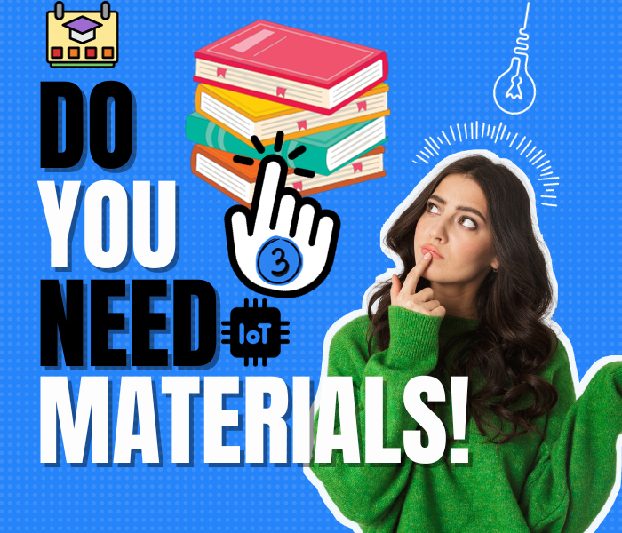

# Ⅲ- Semester
| TEACHING UNIT                | SUBJECT                      | COEF |CREDIT    |  Your Hands On  | 
|:--------                     |:--------                    | :--------:   |:--------: |:-------- |
| Proba & Opti              | [Graphs & Optimization](#📖-graphs--optimization)                     |     1  |    2 | |
| Proba & Opti                 | [Probability](#📖-statistical-probabilities-stati)                      |     1  |   2 |  |
| LAN & Multi                    | [Industrial Local Area Networks](#📖-industrial-local-area-networks)   |     2    |    4 |[Cisco Packet Tracer](https://www.netacad.com/courses/packet-tracer)  |
| LAN & Multi                     | 	[Multimedia Technologies]()          |     1    |    2 |  |   
| InfoSys        | [Unified Modeling Language](#📖-unified-modeling-languageuml)              |    1    |    2 |  |
| InfoSys        | [	Foundations of Databases](#📖-foundations-of-databases)           |     1  |    2 | [phpMyAdmin](https://www.phpmyadmin.net) |
| Programming    |  [OOP in C++](#📖-object-oriented-programming-oop-in-c)   |     1,5  |    3 |  |
| Programming    | [Python Coding Workshop](#📖-python-coding-workshop)            |     1,5  |    3 |  [Pycharm or any](https://www.jetbrains.com/pycharm/)  |
| Optional unit | 	[Sensors and Instrumentation](#📖-sensors-and-instrumentation)                      |     1,5    |   3 |  |
| Embedded Prog| [µC Architecture (STM32 in C)](#📖-µc-architecture-stm32-in-c)      |     1,5    |    3 | NaN  |
| Language & CC | [English](#📖-english)     |     1    |    2 |  |
| Language & CC  | 	[Business Management](#📖-business-management)     |     1    |    2 |  |

***

## 📖 Graphs & Optimization

We kick off with an in-depth exploration of Graph Theory, covering everything from the basics to the intricate Notion of Hamiltonian graphs. 

Navigate through Trees and Arborescence, tackle the nuances of Coloring graphs, cliques, and stables, and master the art of finding the Shortest Path. 

- Graph Theory: General
- Notion of Hamiltonian graph
- Trees and Arborescence
- Coloring graphs, cliques, and stables
- Shortest path
- Formulation of a maximization problem
- Formulation of a minimization problem

Gear up for practical application—Prepare to implement the insights gained in Graph Theory, master the art of navigating Hamiltonian graphs, and apply efficient strategies to solve real-world problems.

---

## 📖 Statistical Probabilities Stati

Dive into Probabilistic Models, Unveil the hidden patterns in unpredictable scenarios, dissect the behavior of Real Random Variables and much more.

- Probabilistic Models
- Real Random Variables
- Continuous Random Variables

Most students hate this subject not knowing the actual potential it hides.

Don't be most people.

---

## 📖 Industrial Local Area Networks

Welcome to the lovely subject of the millions if not the billions.

Networking is in everything and everything is networking. 

- Local Networks: General Presentation
- The OSI Model
- The Ethernet LAN Technology Standard
- Industrial Local Area Networks

Get the most out of this and always learn more.

---

## 📖 Multimedia Technologies

Here you will get into the origin of the pictures you took via the modern iphone or you spend your entire day swipping on instagram.

- Introduction to Multimedia
- Treatment of Multimedia Data: The Sound Signal
- Treatment of Multimedia Data: The Pictures

Too much calculations but so much worth it for the foundation of today quality.

---

## 📖 Unified Modeling Language(UML) 

Information Technology is all about presenting an idea to people and getting their validation.

This is the basic building block to visuals. You'll learn how to see things connected, connect yours and innovate.

- User Case Diagram
- Class Case Diagram
- Sequence Case Diagram

I used sequence case diagram just yesterday in a job interview submission to highlight the process of CICD.

---

## 📖 Foundations of Databases  

You see things but can you interact with them? Can you sign up and having your credentials saved somewhere safe?

Whatever is happening other that what you just see needs a database and that's why this subject is in place.

You'll learn it in a very structured approach to end up an SQL master.

- Introduction to Databases
- Entity-Association (EA) Model
- Modèle Relationnel et Passage EA-Relationnel
- SQL: Definition Language of Data (LDD)
- SQL: Langage de Manipulation des Données (LMD)
- SQL: Data Control Language (LCD)

Once done, you can go try things like hosting a wordpress? or deploy a ghost application with an external SQL system like Google MySQL? Or AWS RDS.

The choice is yours but also, get this on school right.

> SQL : Structured Query Language

---

## 📖 Object-Oriented Programming (OOP in C++)

POO is a more advanced way to coding and you need to implement it. We did it in cpp, other friends in networking did it with java.

Both cute, learn coding the right way.

- Introduction to C++
- Basic Elements of C++
- Heritage
- Interfaces in C++

Make great assurance to give C a great time prior.

---

## 📖 Python Coding Workshop 

More coding, the top tier language on earth.

Very easy, very powerful and get so much shit done.

- Introduction to Python
- Basics: Variables, Types, Control Structures, Iterative Structures
- Python Control Structures
- Standard Containers in Python
- Python Functions
- The Files
- Object Oriented Python

You can consider python for fulltime and make your life bet on it.

---

## 📖 Sensors and Instrumentation 

This subject holds significant importance for me personally

A solid foundation in the intricate yet powerful realm of small hardware components.

- Metrologie Notion
- Connected Sensors

Also, the teacher was amazing and I think she explained things great.

---

## 📖 µC Architecture (STM32 in C)
Coding micro controllers is part of this. You'll expand on the above but with real code on c and on specific card.

- Introduction to µC Architecture ARM
- GPIO
- ADC
- Timers/PWM
- LCD

I love the moments I had here, while learning and thinking about innovation.

---

## 📖 English

I love english and I think you should too.

- Word Processing
- GUI Operating Systems
- Spreadsheets and Databases

I love english and I think you should too again.

---

## 📖 Business Management
An excellent approach to better understand proper behavior within a specific setting.

- The Company and Its Environment
- Management and Manager
- The Management Process
- Business Functions

Learn those lessons that you will apply later on.

