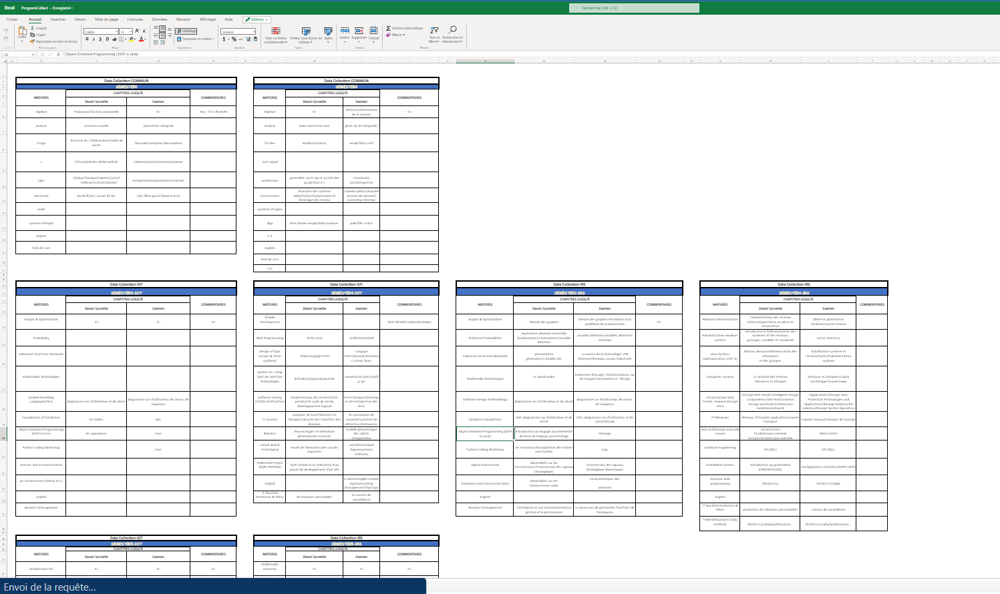
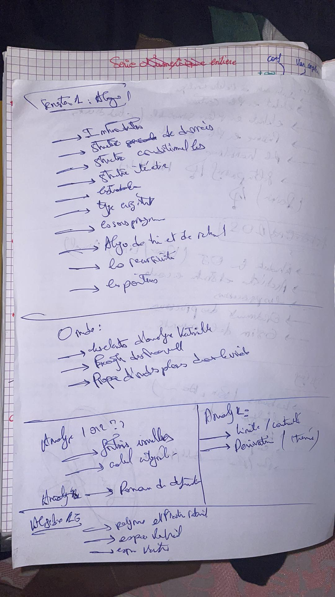
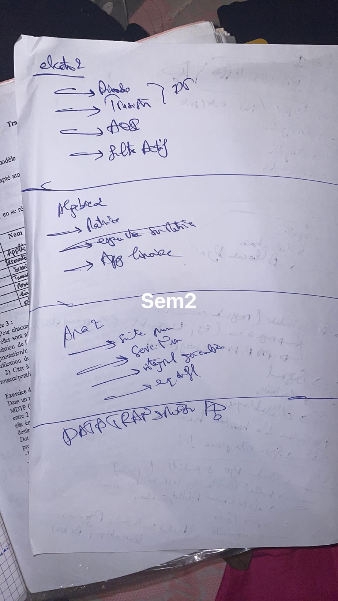
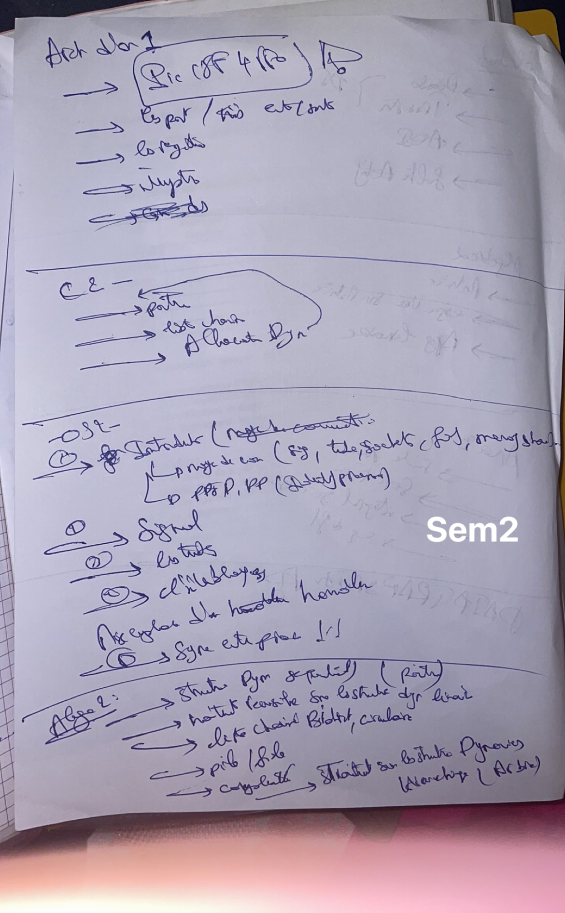

# Behind The Scene 

It's basically impossible to showcase all of the processes we went through to get to where we are now, and we will keep going.
It takes  time to thoroughly explore and collect the topics, and that often requires going through a lengthy process of research and analysis. This can involve gathering information from a variety of sources, asking questions and seeking clarification, and carefully considering different materials.

###  Sharepoint
Gladly, I started working during that time period, so I could use some of my office tools, and I created a sharepoint excel and sent the link to my classmates, asking them to contribute and help me collect different chapters.

We wasn't able to collect everything yet, but yet still good step ahead.

## Collecting chapters

