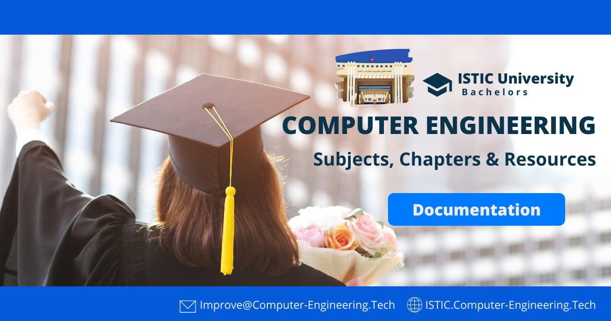

# Bachelors in Computer Engineering | Details
Hey there, and I hope this has been helpful in your studies. The project is constantly being improved and we believe that with your value, we can be of greater assistance to other students. As a result, we welcome your contribution at any given time.

## Contribution Options
We have provided several options for you to empower the project.
You will find an email address in the asset above where you can send your improvement: articulation, attachments, and more.. You can also contribute right away via github, which is the preferred method for getting your contribution into production as soon as possible.

- **Email US:** 📧 Improve@Computer-Engineering.Tech
- Open a pull Request, Issue and more via GitHub

If you have a specialty request, please write it to one of the email addresses below.
- **IOT:** 📧 Yahya@Computer-Engineering.Tech
- **IRS:** 📧 Jawher.smida@Computer-Engineering.Tech

Furthermore, do you have something quick to share? Fill out this [form](https://forms.zohopublic.com/isticbc/form/Resources/formperma/1-4w1KAlQUkKxzvRsc2V688moUg8Ki1yM7fQVmrZpuQ?fbclid=IwAR1FDnq3LGfBSceGha03cWRwXUorw1WSEr_uuH7_egYI33ePVNUCJ0ylLJQ).

### Why are WE doing this?
We were and remain the type of students who learned most things online; it was always the preferred method of acquiring knowledge and passing exams. This is where the idea for this project arose. Everything is obviously available on the internet; it's just a matter of searching. Our goal is to gather as much useful information as possible so that you can complete your degree from the comfort of your own home.
  

> Get Started from [Here](README.md).
