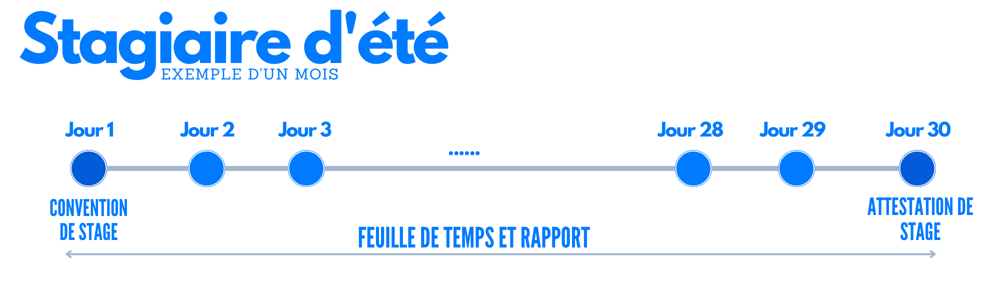

 
 

# Stage obligatoire 1 : Stage d'été
Après avoir terminé la deuxième année et 4 semestres de réussite, l'étudiant devrait être en mesure de rechercher et d'obtenir un stage. Il est fortement recommandé de rechercher une expérience antérieure à celle-ci ; plus vous procéderez tôt, plus vous vous élèverez.

### Documents à considérer
- [Modèle de Convention de stage d'été](https://github.com/Y4HYA4/TheRealBachelorsDocs/blob/main/docs/images/InternsAssets/Convention-Stage-ete.pdf)
- [Modèle de feuille de temps](https://github.com/Y4HYA4/TheRealBachelorsDocs/blob/main/docs/images/InternsAssets/Journal-de-stage.docx)
- [Exemple d'Attestation de stage](images/InternsAssets/certificate.md)
- [Rapport de stage](https://github.com/Y4HYA4/ExperienceInCloud/tree/main/First_InternReport#internship-report-at-linedata)

# Flux de travail

**1-** Dès votre entrée en fonction, vous devez signer une convention de stage dans l'entreprise et l'apporter à l'université. 
**2-** L'entreprise fournit une attestation de formation qui comprend la durée et est portée à l'université. 
**3-** Votre feuille de temps, ainsi que votre rapport de stage, doivent être signés et remis avant la date limite à l'université. 
**4-** Préparez une présentation et parlez-en ! 

## Présentation - Projet de fin d'année - PFA
Après avoir terminé votre expérience, vous présenterez ce que vous faisiez à l'université.

En plus de votre **rapport de stage**, vous devrez préparer une **présentation PowerPoint** où vous pourrez développer davantage votre rapport et exprimer votre expérience.

C'est une excellente occasion pour vous de partager ce que vous avez appris pendant votre stage tout en renforçant votre confiance dans le monde réel.
De plus, en partageant votre expérience, vous pourrez aider d'autres personnes qui sont dans la même situation que vous et leur montrer qu'il est possible de réussir.

Enfin, la présentation vous aidera à améliorer vos compétences en communication et en points de contact. Ceux-ci sont nécessaires pour tout professionnel, qu'il s'agisse de communiquer avec des clients ou des collègues. Vous pourrez mieux vous connecter avec ceux qui vous entourent et établir des relations solides si vous prenez le temps d'apprendre et d'améliorer ces compétences.

## Stage d'été, mon expérience

| Actions |Date|
| :-------- |:-------- |
| Attestation + Certificat | 15 juillet 2022|
| Rapport + Feuille de temps | 7 octobre 2022|
| Présentation | 19 novembre 2022 |

## Conseils pour une expérience réussie
- Soyez axé sur les objectifs en fonction de ce que vous voulez apprendre et de ce qui vous intéresse avant cette date.
- Maintenez une feuille de temps régulière et gardez une trace de vos activités quotidiennes en attendant l'expérience.
- Interagissez avec vos collègues et faites de la communication un élément clé.

