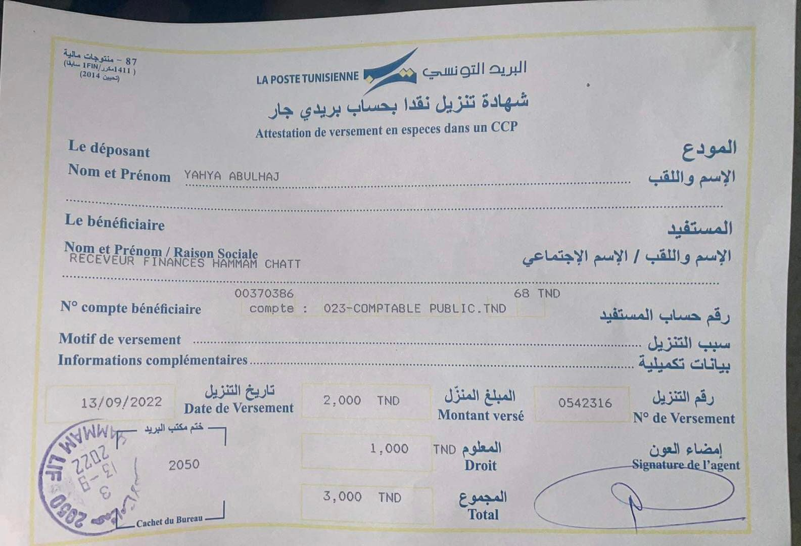
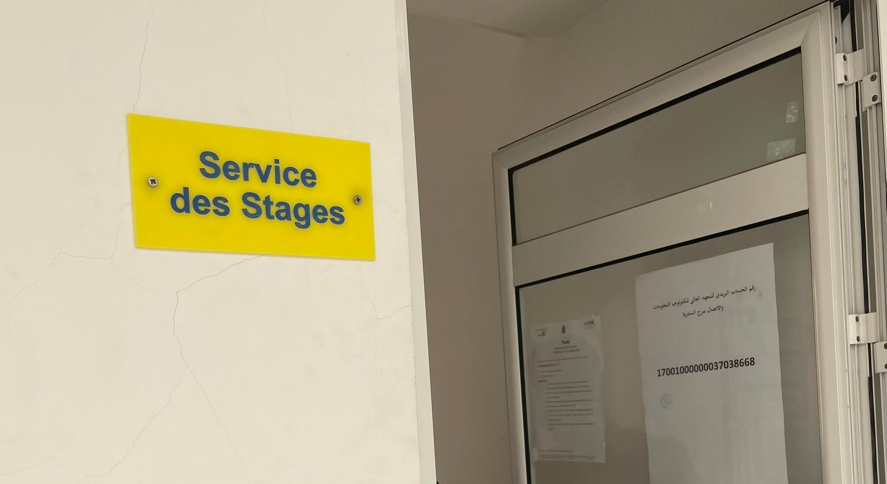

# Training certificate

A simple paper that you receive from the company that includes information about your internship period and must be signed by them and delivered to your university administration.

 A copy of this document, along with the Intern agreement, should be delivered to the University as soon as possible.
> Here's [an example of mine](attes.png)

**Note:** Make a post deposit of 2TND + 1TND fees to the below number and bring the receipt along with the two above-mentioned documents to the university.
> Post Number: 17001000000037038668

## Summary
These should be included in the initial internship process.
- Intern Agreement
- Training certificate
- Post Receipt

Please consult the administration on the second stage as follows for more information.

> [In cases assets are not showing.](https://github.com/yaya2devops/Bachelor-Guide/blob/main/docs/images/InternsAssets/certificate.md#training-certificate)