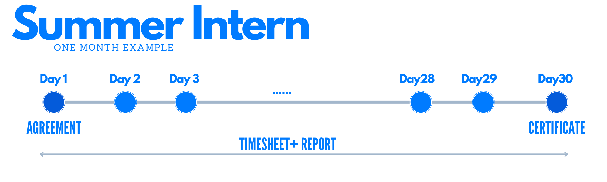
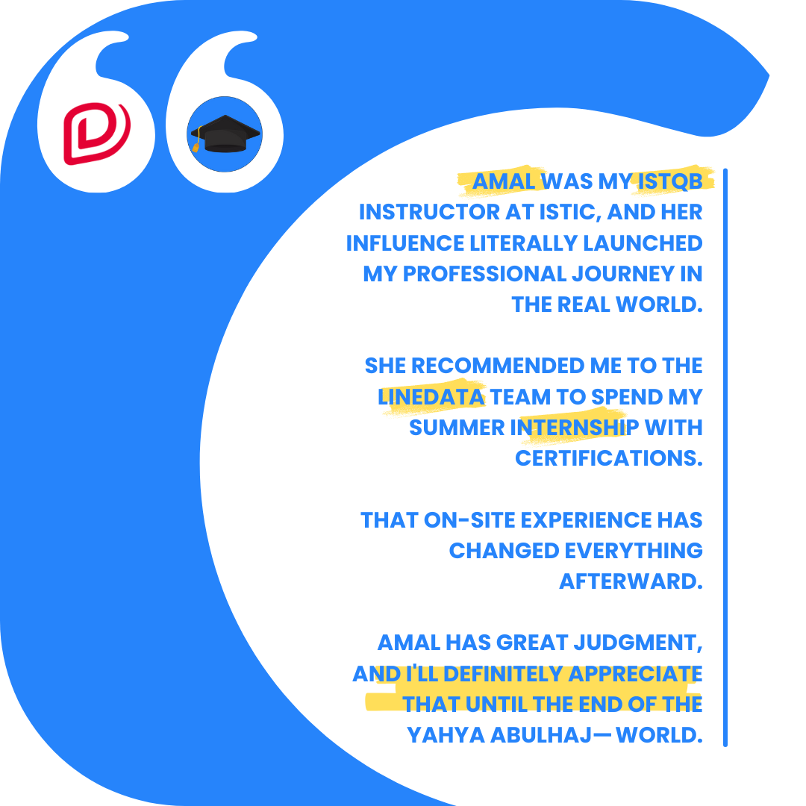

 
 

# Mandatory Internship : Summer Intern
After every two semesters, student should be able to look for and secure an internship. 

- [What's Expected Of You](#workflow)
- [Present 2nd Year Project](#present-2nd-year-project)
- [Reflections on My Own Intern](#reflections-on-my-summer-internship)
- [Tips To Win Your First Experience](#tips-for-a-successful-experience)

It is strongly recommended that you seek related experiences earlier than that;  The earlier you proceed, The higher you will rise.

## 🤖 [LaTe𝕏, Report, help ?](prompt-engineer.md)  

The following content is authored in LaTeX. If you're interested in learning how to begin, click the link above.

<iframe src="pfa/pfa.html" width="150" height="700"></iframe>

### Not only that.

### [Expand on acknowledgments.](pfa/ack-amal.md)

I want to first thank Amal for the chance to work at [Linedata](https://www.linedata.com). 

Just a month in, and I've already landed another opportunity at a [canadian startup](https://nxci.ca) to move up.

And then I also gift you the following papers I created for you; in one click.

| Papers                      | Description                                          |
| ---------------------------|------------------------------------------------------|
| [Summer agreement](https://create.ya-ya.tech/ISTIC/Convention-Stage-ete.pdf)| An agreement document for your summer internship.        |
| [Timesheet Template](https://create.ya-ya.tech/ISTIC/Journal-de-stage.pdf)          | A template for recording the hours worked during an internship.|
| [Training certificate](https://github.com/yaya2devops/bachelor-guide/blob/main/docs/images/InternsAssets/certificate.md)        | A certificate that acknowledges the completion of a training program at company **A**.|
| [Internship Report](https://github.com/Y4HYA4/ExperienceInCloud/tree/main/First_InternReport#internship-report-at-linedata)           | A report detailing the experience gained during an internship. |

# Workflow

Let's discuss further what you should be doing.

1. As soon as you start, you must sign an internship agreement at the company and *deliver* it to university. 
2. The company provides a training certificate that includes the duration and is taken to the university. 
3. Your timesheet, along with your internship report, must be signed and delivered by the deadline to the university. 
4. Prepare a presentation and speak up! 

## Present 2nd Year Project
After you finish your experience, you will present what you were up to the university. 

Along with your **[Internship report](https://fr.wikipedia.org/wiki/LaTeX)**, you will be required to prepare a **[PowerPoint](https://fr.wikipedia.org/wiki/Microsoft_PowerPoint)** where you can develop more on your report and express your experience.

This is an excellent opportunity for you to share what you have learned while also enhancing your confidence in the real world.

By so, you will be able to assist others who are in the same situation as you. 

I'm doing exactly that for you!

Presenting will help you improve your communication skills. Prepare!

## Reflections on My Summer Internship

The dates of delivery that I had while my summer intern are listed below.

| Actions                      |Date|
| :--------                   |:--------   |
|     Agreement +  Certificate  | 15 July 2022|
|    Report + Timesheet  | 7 October 2022|
|    Presentation   | 19 November 2022 |

## Tips for a successful experience
- Be [goal-oriented](https://greatergood.berkeley.edu/article/item/seven_ways_to_find_your_purpose_in_life) in terms of what you want to learn and what interests you prior to this date.
- Maintain a [regular timesheet](https://www.healthline.com/health/benefits-of-journaling#reduced-stress) and keep track of your daily activities meanwhile the experience.
- Interact with colleagues, and make [communication a key focus](https://www.linkedin.com/pulse/power-effective-communication-digital-age-shaik-saleem#:~:text=Clear%20and%20Concise%20Messaging%3A%20In,it%20comes%20to%20digital%20communication.).

As I conclude, my final advice to you is to get going, even in situations where you may not fully understand.
Take action, ask questions, seek guidance, and strive to learn more.
It is through these experiences that you will truly grow into [the architect of your own success](https://www.redbull.com/int-en/how-to-shape-your-future-based-on-strengths).

---

 
