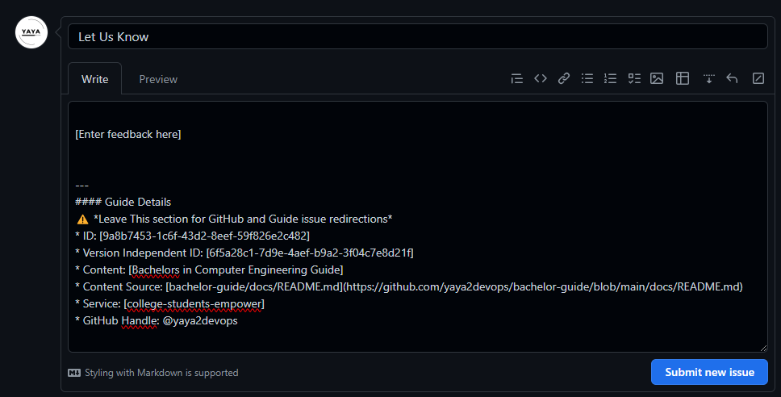

## A Roadmap for Your Unique Issue

We'll go through the process of making a customized GitHub issue direction URL, enabling you to seamlessly assist users in requesting support for their issues.


<details>

<summary>
Facilitating their resolution with a pre-filled, personalized message.
</summary>

<br>

|💡Issue Explained| It is like a virtual sticky note where people can write down problems, ideas, or tasks related to a project. |
|---:|:---|





</details>

<br>

1. Start with the base URL for creating a new issue in your repository:
```
https://github.com/your-username/your-repo-name/issues/new
```
Replace `your-username` with your GitHub username and `your-repo-name` with the name of your repository.

2. Add the `title` parameter to set the issue title (optional):

```
?title=Your%20Issue%20Title
```

Replace `Your%20Issue%20Title` with the desired title for the issue. If you don't want to pre-fill the title, you can omit this parameter.

3. Add the `body` parameter to set the issue description (custom message):

```
&body=Your%20custom%20message%20here
```

Replace `Your%20custom%20message%20here` with the message you want to pre-fill in the issue description.

4. Here's the complete URL with both the title and body parameters:
```
https://github.com/your-username/your-repo-name/issues/new?title=Your%20Issue%20Title&body=Your%20custom%20message%20here
```
When users click on this URL, it will take them to the "New Issue" page in your repository with the title and custom message pre-filled. 

Remember to replace `your-username` and `your-repo-name` with your actual GitHub username and repository name, and customize the title and message as needed.


To exemplify this idea, let's begin with a call to the base URL and easy query parameters for the body only.

* **Base URL:** `https://github.com/yaya2devops/bachelor-guide/issues/new` - This is the base URL of the GitHub repository where the issue is being created.


```sh
https://github.com/yaya2devops/bachelor-guide/issues/new?title=&body=%0A%0A%5BEnter%20feedback%20here%5D%0A%0A%0A
```


Best, consider passing additional data in the parameters  and deliver a query of a sophisticated nature.


* **Query Parameters:**
   1. Set the title of the new issue to "Let Us Know."
   2. Set an interesting body content for the issue e.g. for guide details and additional information related to the issue, including IDs, content details, source, service, and GitHub handle.

```sh
https://github.com/yaya2devops/bachelor-guide/issues/new?title=Let%20Us%20Know&body=%0A%0A%5BEnter%20feedback%20here%5D%0A%0A%0A---%0A%23%23%23%23%20Guide%20Details%0A%E2%9A%A0%20*Leave%20This%20section%20for%20GitHub%20and%20Guide%20issue%20redirections*%0A*%20ID%3A%20%5B7e2c0e6e-8b6d-4c2f-aaef-15f736a7b2a1%5D%0A*%20Version%20Independent%20ID%3A%20%5Ba5f1d387-7be9-4f0c-b92d-d52d16ef1d8e%5D%0A*%20Content%3A%20%5BBachelors%20in%20Computer%20Engineering%20Guide%5D%0A*%20Content%20Source%3A%20%5Bbachelor-guide/docs/README.md%5D(https://github.com/yaya2devops/bachelor-guide/blob/main/docs/README.md)%0A*%20Service%3A%20%5Bcollege-students-empower%5D%0A*%20GitHub%20Handle%3A%20%40yaya2devops
 ```

The URL will simplify the process of creating a new issue for users.


Make sure to [share this URL with your users to direct them to create issues](https://github.com/yaya2devops/bachelor-guide/issues/new?title=Let%20Us%20Know&body=%0A%0A%5BEnter%20feedback%20here%5D%0A%0A%0A---%0A%23%23%23%23%20Guide%20Details%0A%E2%9A%A0%20*Leave%20This%20section%20for%20GitHub%20and%20Guide%20issue%20redirections*%0A*%20ID%3A%20%5B7e2c0e6e-8b6d-4c2f-aaef-15f736a7b2a1%5D%0A*%20Version%20Independent%20ID%3A%20%5Ba5f1d387-7be9-4f0c-b92d-d52d16ef1d8e%5D%0A*%20Content%3A%20%5BBachelors%20in%20Computer%20Engineering%20Guide%5D%0A*%20Content%20Source%3A%20%5Bbachelor-guide/docs/README.md%5D(https://github.com/yaya2devops/bachelor-guide/blob/main/docs/README.md)%0A*%20Service%3A%20%5Bcollege-students-empower%5D%0A*%20GitHub%20Handle%3A%20%40yaya2devops). 


####  Coding Dreams
The URL leads people directly to a sign in/up page in order to view the issue.

When taking such action, it has the potential to ignite their interest in the platform and motivating them to become future developers.

And in that way, you were a significant factor behind such a noble decision!

 


