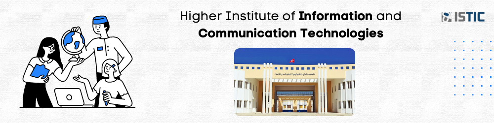
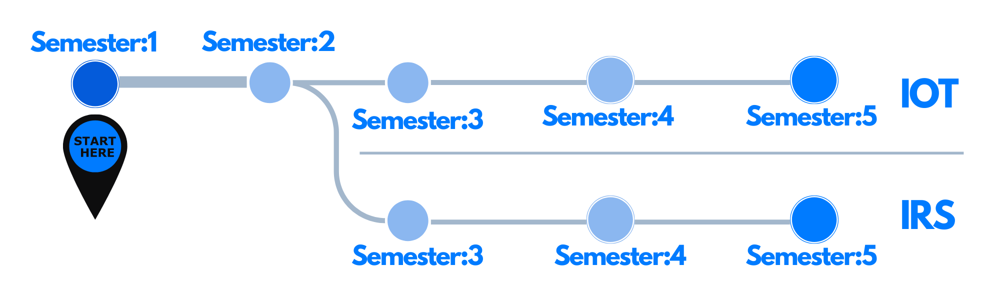
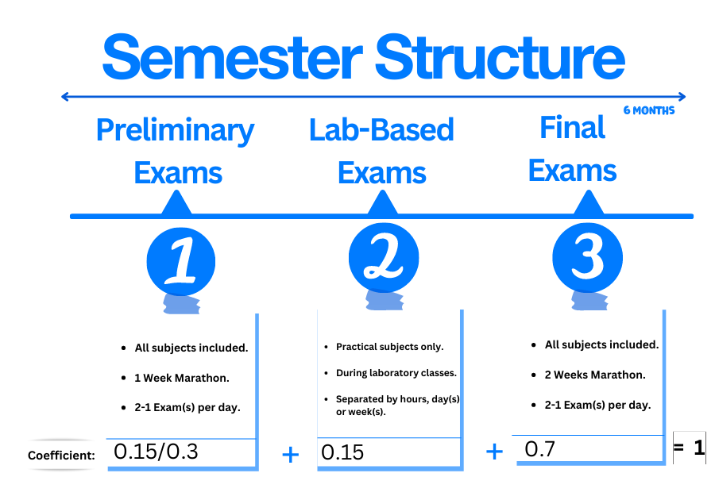

 

# Motivation

Welcome to the guide for aspiring bachelor's students pursuing a career in information technology!

**Is it right for you?**

- Future-proof career: The demand for IT professionals like you is expected to continue growing
- Versatile skills: Comprehensive skill set that allows you to adapt to changing tech
- Lucrative earning potential: Companies are willing to invest more and more in top talent

You can now decide.

🎯 Let's jump on this exciting journey together and discover the fascinating world of information technology!

# Empowering Students

This guide aims to complement your Computer Engineering degree by introducing you to a range of remarkable innovations that the world is constantly leveraging to provide value incl. web, mobile development, computer architecture, security, embedded systems, cloud computing, and software testing.

**TL;DR** The content presented does not carry any official affiliation or rights from the designated institution.

Instead, it represents a collaborative endeavor by individuals committed to delivering information, resources and help you level up.

# Path to options

In terms of your degree, you have 5 semesters total. After 2 semesters, the student should be able to select one of two specialties for the remaining three semesters.

This will enable the pursuer to concentrate their studies on a specific area and gain more knowledge in that domain.

- IOT & Embedded systems (IOT)
- Network and Systems Engineering (IRS)

> ISTIC used to assign students with higher grades to IOT; This could imply that IOT is the best option. It is not. Both paths are excellent.

# Examining methodology

The asset below depicts the proctoring methodology used for each semester.

- **1:** A written exam on all of the subjects covered.
- **2:** Hands-on exams for specific subjects that necessitate the use of software.
- **3:** Final exams, which play the most important role in the semester's success.
  

# Professional Experience: Internship

Students are required to have at least **two** **internships**. Internships provide students with the opportunity to gain experience in their field of interest and to develop professional skills.

|                    |                         Required Internships                          |
| :----------------: | :-------------------------------------------------------------------: |
| Mandatory Intern1: | [Summer Internship](https://istic.computer-engineering.tech/#/intern) |
| Mandatory Intern2: |                        End-of-study Internship                        |

# Get Started

Each section will include usefull resources and content to assist you in excelling in your preparation and making the most of your education.

##### The documentation is structured as follows.

| Mutual                       | IOT & Embedded systems Speciality      | Network and Systems Engineering Speciality | Compressed Materials                 |
| ---------------------------- | -------------------------------------- | ------------------------------------------ | ------------------------------------ |
| [Semester Ⅰ](Semester1/1.md) | [Semester Ⅲ - IOT](Semester3-IOT/3.md) | [Semester Ⅲ - IRS](Semester3-IRS/3.md)     | [The Everything](ISTIC_Materials.md) |
| [Semester Ⅱ](Semester2/2.md) | [Semester Ⅳ - IOT](Semester4-IOT/4.md) | [Semester Ⅳ - IRS](Semester4-IRS/4.md)     |
|                              | [Semester Ⅴ - IOT](Semester5-IOT/5.md) | [Semester Ⅴ - IRS](Semester5-IRS/5.md)     |
