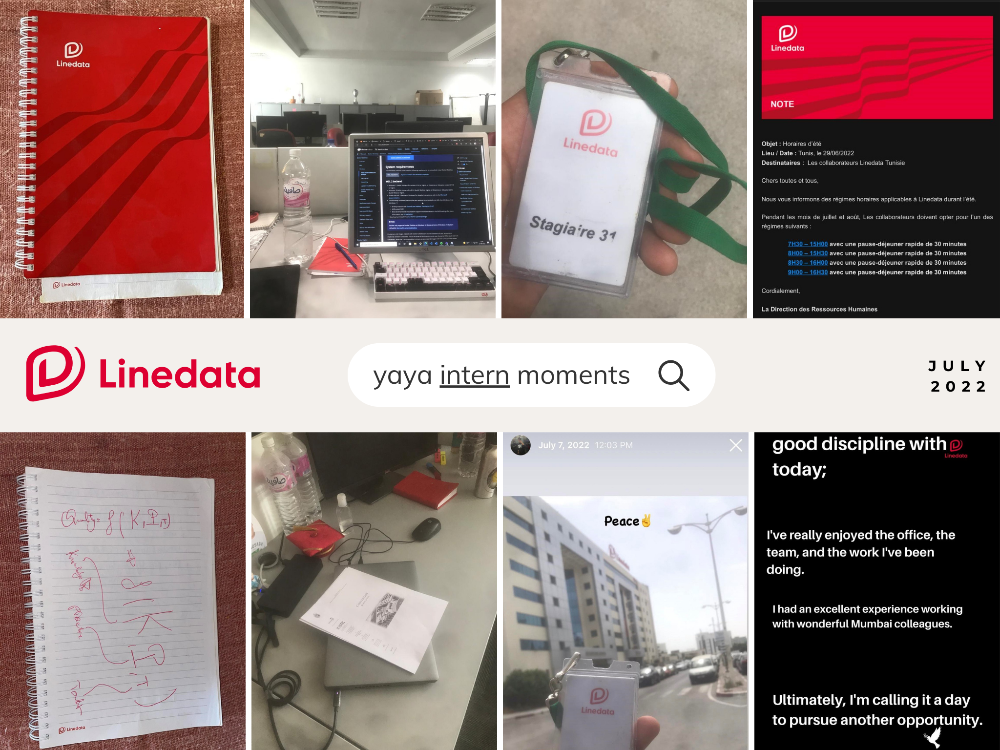

#### Yahya reported to Amal directly

> <b>Amal</b> was my ISTQB instructor at ISTIC, and her influence literally launched my professional journey in the real world.
>   She recommended me to the Linedata team to spend my summer internship with certifications.
>   That on-site experience has changed everything afterward.
>   Amal has great judgment, and I'll definitely appreciate that until the end of the world.

|Linedata Tunisia - 7th Quality Assurance Floor, as HR Department |
|:---|
| Cleopatre Center Building, Block B - North Urban Center1082 - TUNIS, Tunisia|

# Related Assets

> Yaya & Internships ! Fun, [next.](https://istic.computer-engineering.tech/#/../pfe)
