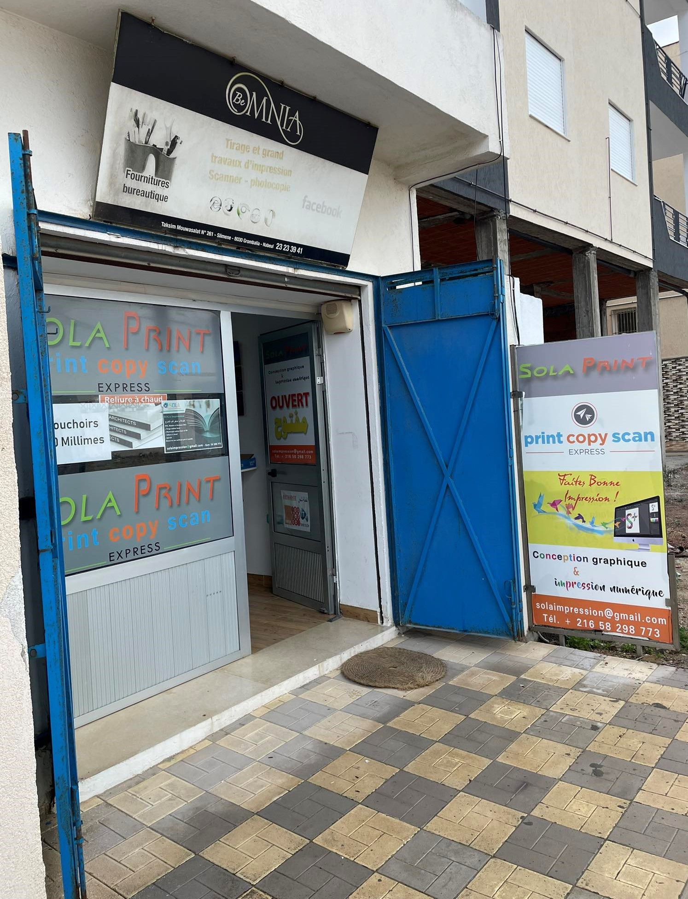
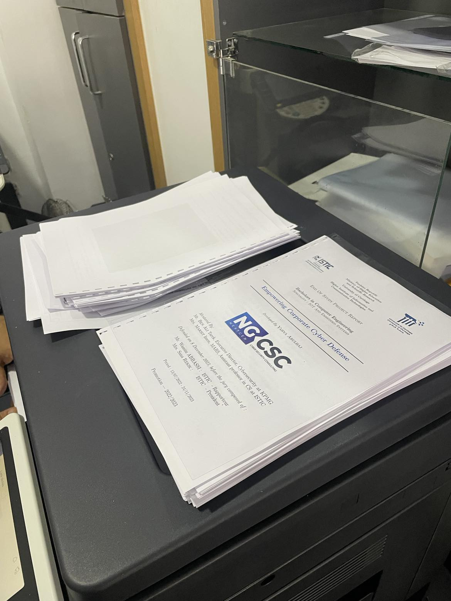
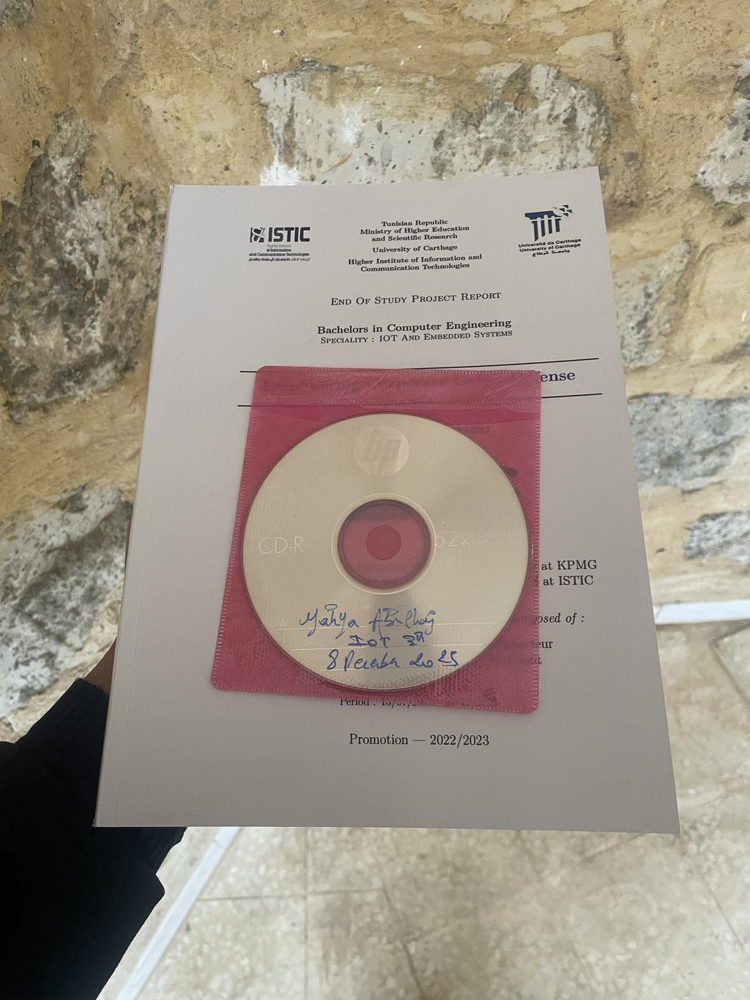

# When You Are Done 

There will come a time when your report comes to an end. You may also decide that it is now the time for just that.

At that exact point, you'll have to print it.

There is a good place around you just for that.

Take your content after you have converted it to PDF. 

Don't say you don't know how, I showed you [exactly how](../learntex.md).

- Get out of [technopole (2/2)](https://isticampus.s3.eu-west-3.amazonaws.com/navigator/round/7-step-to-techno-pole.png) to the right-front.
- Take it [in USB](https://en.wikipedia.org/wiki/USB) or via email to the following.

## You should not have it this way.

## You should have it this way.

You will also need a CD, as discussed. The same place where you printed can serve it for you.

- Do that, take them and take both to the library.
- And if you feel lost, you can always [get back and learn more](../pfe.md).

That's with the above process, great to see your speed.

Now proceed with the following to get some knowledge.

---

