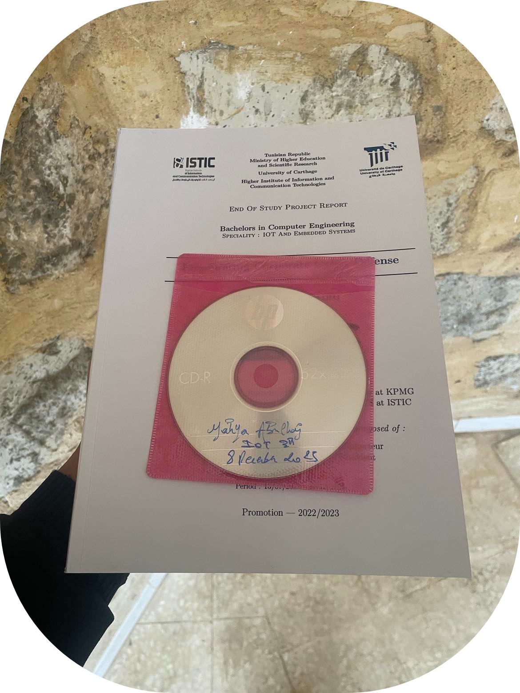
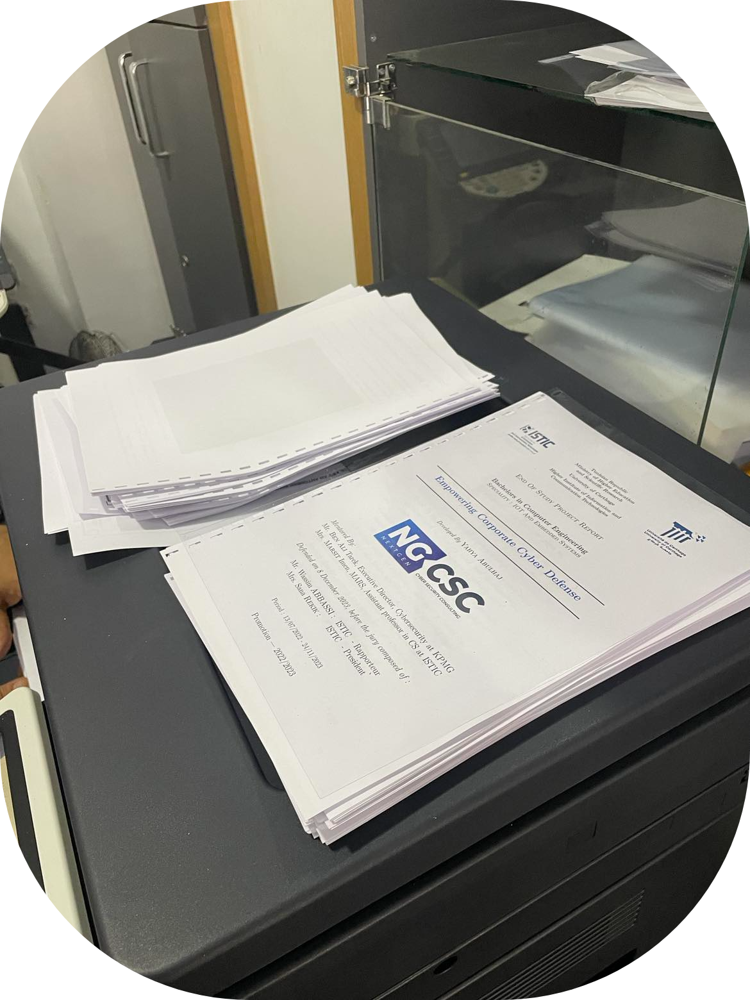
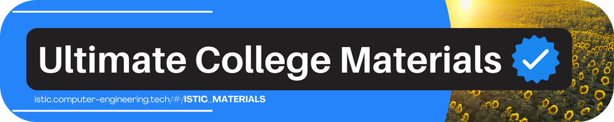

 

# When You Are Done 

There will come a time when your report comes to an end. 

You [may also decide](https://www.forbes.com/sites/forbescoachescouncil/2023/05/05/16-proven-methods-to-enhance-executive-decision-making-skills/?sh=7cd5cb823a31) that it is now the time for just that.

At that exact point,  
**You'll have to [print it](https://en.wikipedia.org/wiki/History_of_printing)**.

There is a **good placeᵨ** around you,  
Just for that.

Take your content converted it to PDF. 

Don't say;  
You don't exactly know how. 
I showed you [exactly how](../learntex.md).

- Get out of [technopole (2/2)](https://isticampus.s3.eu-west-3.amazonaws.com/navigator/round/7-step-to-techno-pole.png) right-front.
- Take it [in USB](https://en.wikipedia.org/wiki/USB) or via email toᵨ.

## — Sola Printᵨ — 

## — HAVE IT THIS WAY — 

## — PLZ , NOT THIS — 

 

Lastly, 
You will also need a CD, as discussed. 

This same place where you just printed your report can also serve it for you.

- Take them to college library.

This will be explained in end of study project report exposure. 

That's with the above process. 
Great to see your speed.

Now proceed with the following to get some knowledge.

---

