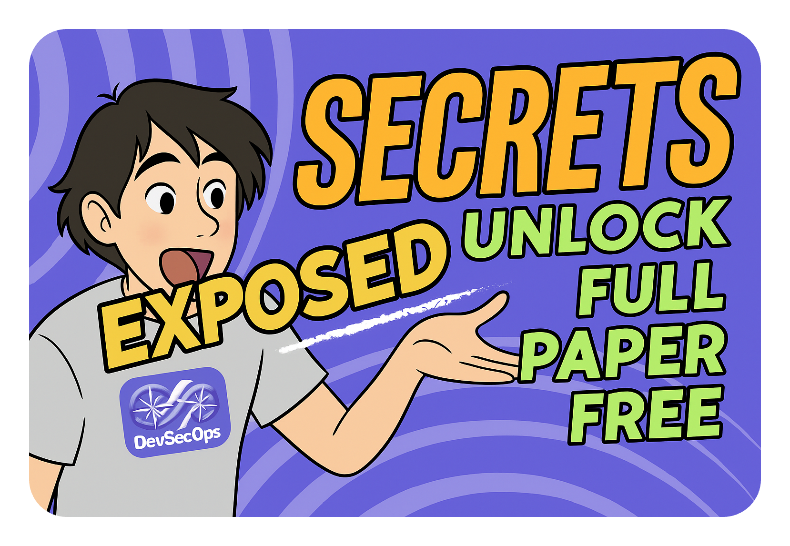
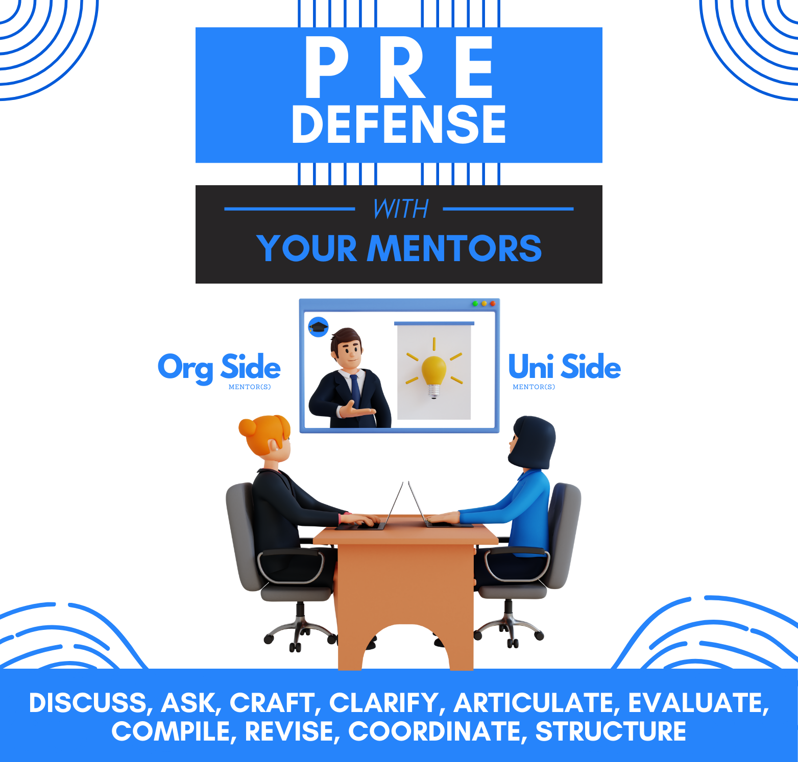
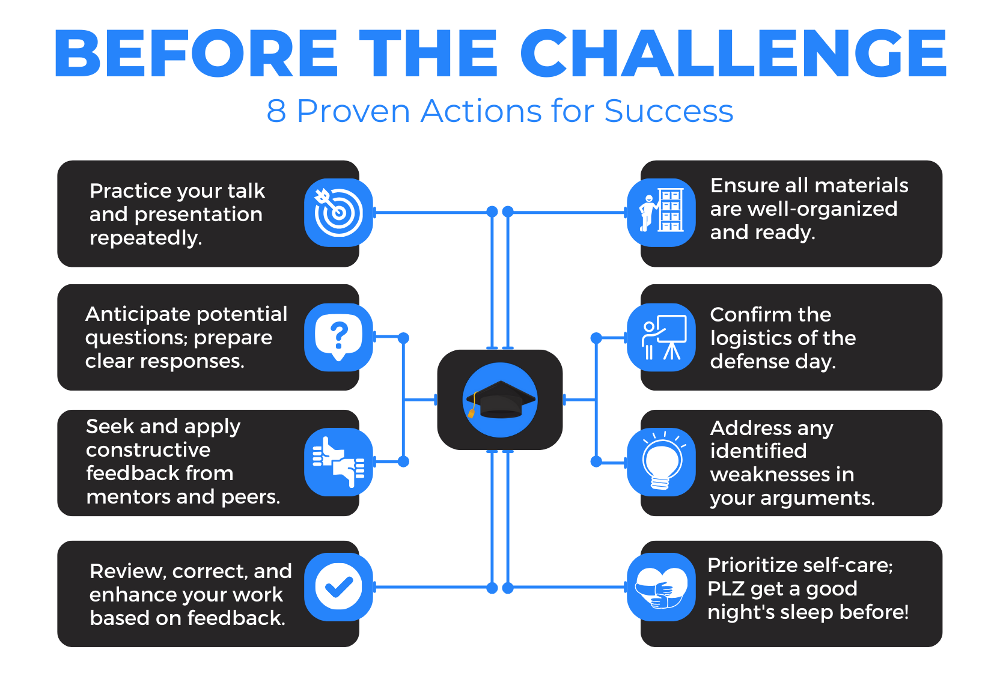
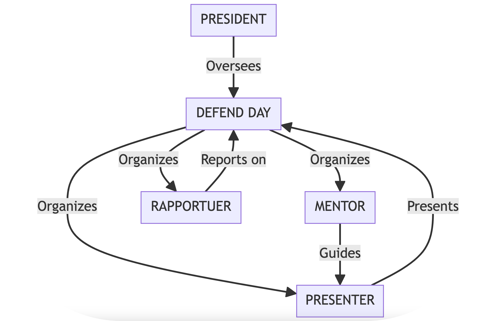
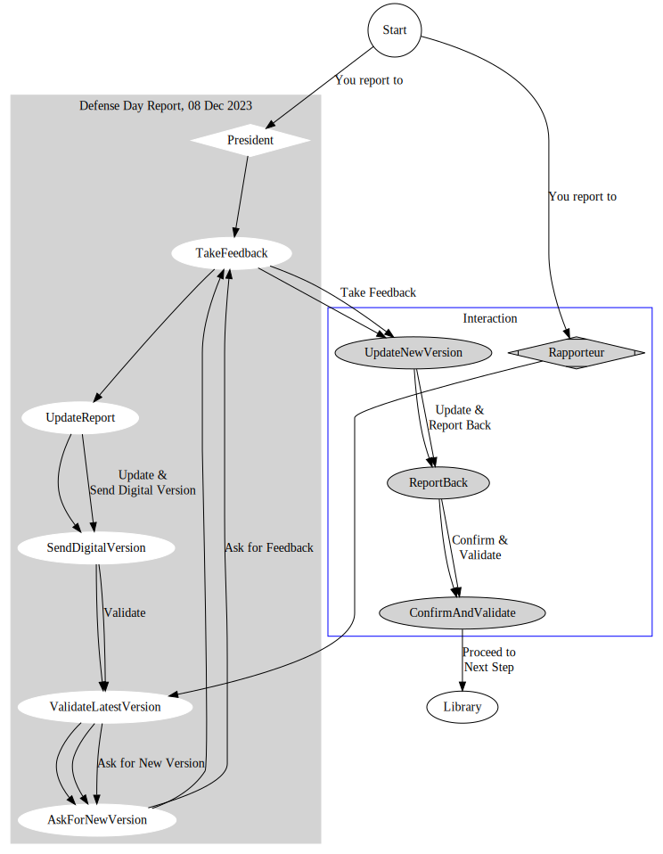
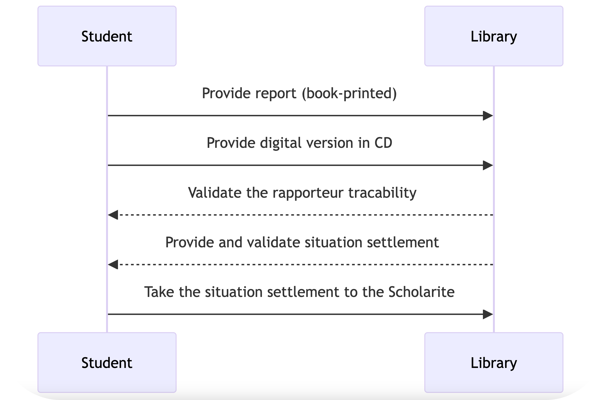
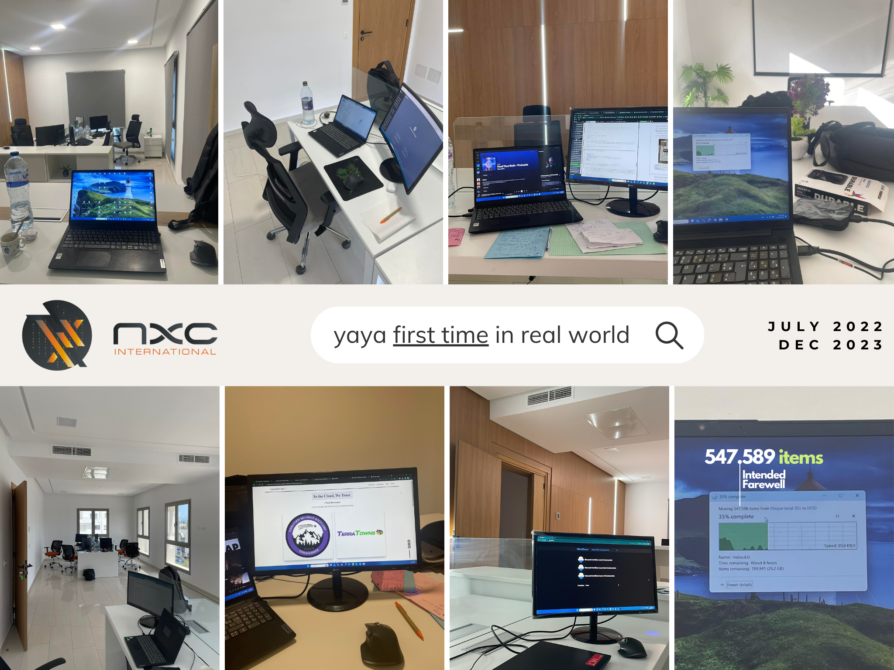
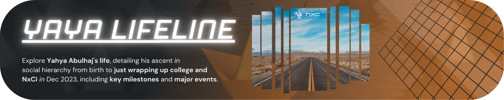

## The Spectacle of Academic Culmination (NxCi)

I will be taking this chance to outline for you the entire process and the social interactions that must be fulfilled in order to get out with a great experience and a lasting memory. Whether you believe it or not, memories make the man and I want you to have more good of that.

After the years spent doing the program, your last exams should be accomplished by a january of a given year.

(Not the case for me, lol, ended on dec)

From this point and beyond please...
- Satisfy the univeristy administration documents.
- Start or continue working on your end of study project.

<iframe src="pfe/snapshot.html" width="150" height="700"></iframe>

---

---

# The Art Of Processing

Considering the papers you have to validate with college. 

You should be more aware of these after [your summer intern](intern.md).

Let me kindly re-step the process in a better way.

- Deposit an amount to the postal service and save the receipt. 
- Take an agreement from your administration and others to company.

**What To Expect:**
- The head of deparment¹ will assign you a mentor² from university side.
- The company executives³ will assign you another mentor⁴ from the org side.

These people are very important to you.

I must highlight the importance of focusing and following their instructions carefully.

After doing works, 4 months later, that day will come.
But before, you must deposit your project report.

Make a memorable printable copy to each of those great people¹⁻⁷.

- You will defend your work in front of the president⁵ and the rapporteur⁶.
- Your mentors²﹐⁴ will stand by your side, ready to protect it alongside you.

Prepare a presentation tell the key findings of your intensive report doing real works.

- Expect to recieve constructive feedback on the defense day.
- Expect to act asap on the feedback of the defense day.
- Make the changes needed, report to the rapporteur.

Once this day and those that follow are fulfilled.

- [x] You followed feedback.
- [x] You had your work validated.
- [x] You succeeded on your Defense Day.

You are ready to proceed to **the next step.**
- Deliver printable final product to the library.
- Deliver digital final product via CD to library.

The coordinator⁷ will verify your assets and confirm your deposit.

You will receive <i>situation settlement</i> confirming the above but also to take it further.

Started with seeking confirmation from the rapporteur regarding his availability.

|[Valid I](https://raw.githubusercontent.com/yaya2devops/bachelor-guide/main/docs/pfe/assets/SS/SS-sig-request-1.jpg) - [Valid II](https://raw.githubusercontent.com/yaya2devops/bachelor-guide/main/docs/pfe/assets/yes-finally.jpg)| [Translate](pfe/assets/translated.md) |
|---|---|

<pre><code class="language-json">
{
  "communication_type": "Email",
  "messages": [
    {
      "sender": "Wassim Abbessi",
      "timestamp": "19 Dec 2023",
      "recipient": "Yahya Abulhaj, Etudiant ISTIC",
      "message": "quand tu seras à l'istic envoie moi un message je viens le signer",
      "role": "Project Rapporteur"
    },
    {
      "sender": "Yahya Abulhaj, Etudiant ISTIC",
      "timestamp": "20 Dec 2023",
      "recipient": ["Wassim", "Marsit"],
      "message": "Bonjour Mr Wassim,\nJe vais prendre ce vendredi. Je serai à ISTIC vers 11h.\nMerci infiniment !"
    },
    {
      "sender": "Yahya Abulhaj, Etudiant ISTIC",
      "timestamp": "20 Dec 2023",
      "recipient": "Wassim",
      "message": "Voici mon numéro : xxx9xx69"
    }
  ]
}
</code></pre>

 

Dr. Wassim also mentioned that he will contact me soon to arrange Azure training sessions. 

I truly appreciated it,

|[Validate](https://raw.githubusercontent.com/yaya2devops/bachelor-guide/main/docs/pfe/assets/SS/SS-sig-request-2.jpg) | [Translate](pfe/assets/SS/translated.md)|
|---|---|

<pre><code class="language-json">
{
  "imessages": [
    {
      "sender": "Wassim Abbessi, Ph.D",
      "medium": "Message texte",
      "date": "Ven, 22 déc à 11h10",
      "subject": "Post-défense",
      "messages": [
        {
          "time": "11h10",
          "content": "Bonjour, je suis à l'ISTIC. Wassim devant l'administration"
        },
        {
          "time": "11h10m",
          "content": "Bonjour Monsieur. S'il vous plaît, la salle"
        },
        {
          "time": "11h10m",
          "content": "devant l'administration"
        },
        {
          "time": "11h11m",
          "content": "Parfait ! J'arrive"
        },
        {
          "time": "11h11m",
          "content": "Merci"
        }
      ]
    }
  ]
}
</code></pre>

 

It went smooth; we met at the student center for it was a pleasant encounter as I handled to him the [current situation settlement](https://raw.githubusercontent.com/yaya2devops/bachelor-guide/main/docs/pfe/assets/SS/SS-before-last-confirm.jpg) so he can sign it **,** and we expressed mutual gratitude.

Everything went well and [S.S fulfilled the following two steps](https://raw.githubusercontent.com/yaya2devops/bachelor-guide/main/docs/pfe/assets/SS/situation-settlement.jpg).

- To the Scholarite to validate your payment stats.
- To the rapporteur for inputs on your performance.

If that goes well and surely will! 

 

As I received excellent feedback even before initiating the process of settling my situation.

Truly remarkable,

|[Validate](https://raw.githubusercontent.com/yaya2devops/bachelor-guide/main/docs/pfe/yay-thanks.jpg) | [Translate](pfe/yay-translated.md)|
|---|---|

<pre><code class="language-json">
{
  "communication_type": "@istic.ucar.tn",
  "messages": [
    {
      "sender": "Marsit imen",
      "timestamp": "8 Dec 2023",
      "recipient": "Yahya Abulhaj - Computer Engineering Student",
      "message": "Merci pour ta réponse. J'ai oublié de te dire que t'as eu \"très bien avec félicitations du jury\" on a oublié de te le dire lors de la délibération. Félicitations!",
      "mentor_type": "Academic Mentor"
    },
    {
      "sender": "Yahya Abulhaj - Computer Engineering Student",
      "timestamp": "8 Dec 2023",
      "recipient": "Marsit",
      "message": "Tout cela grâce à vos incroyables efforts avec moi.\nJ'apprécie vraiment toutes les rencontres que j'ai eues avec vous ainsi que vos instructions et critiques.\nUn grand Merci Madame Imen"
    }
  ]
}
</code></pre>

You are now ready to expect your college diploma!

And also other great assets from your past hard work and effort.

You will be taking those from the administration (1) specifically from the secretarial, and you'll observe where teachers and other staff interact on your exit.

> Explore [where Admin (1) is located](https://campus.computer-engineering.tech).

---

#### Glossary

- ¹: Leader of a university department overseeing a specific field of study.
- ²: A guide and advisor in academia, typically a professor in college.
- ³: Senior Staff or Founders within the hiring company.
- ⁴: A guide and advisor within the org, often an experienced employee.
- ⁵: Responsible for overseeing and evaluating the candidate defense.
- ⁶: Examining the content of reports and offering constructive feedback¹⁻⁷.
- ⁷: Oversees the process of taking reports and publishing them in the school library.

---

