## The Spectacle of Academic Culmination

I will be taking this chance to outline for you the entire process and the social interactions that must be fulfilled in order to get out with a great experience and a lasting memory. Wether you believe it or not, memories make the man and I want you to have more good of that.

After the years spent doing the program, your last exams should be accomplished by a january of a given year.

From this point and beyond please...
- Satisfy the univeristy administration documents.
- Start or continue working on [your end of study project](learntex?id=action-required).

Considering the papers you have to validate with college. You should be more aware of these after [your summer intern](intern.md).

Let me kindly re-step the process in a better way.

- Deposit an amount to the postal service and save the receipt. 
- Take an agreement from your administration and others to company.

**What To Expect:**
- The head of deparment¹ will assign you a mentor² from university side.
- The company executives³ will assign you another mentor⁴ from the org side.

These people are very important to you and I must highlight the importance of focusing and following their instructions carefully.

After doing works, 4 months later, that day will come.
But before, you must deposit your project report.

Make a memorable printable copy to each of those great people¹⁻⁷.

- You will defend your work in front of the president⁵ and your rapporteur⁶.
- Your mentors²﹐⁴ will stand by your side, ready to protect it alongside you.

Prepare a presentation tell the key findings of your intensive report doing real works.

- Expect to recieve and act on the feedback of the defense day.
- Make the changes needed, report to the rapporteur.
- Deliver the final product to the library.
- Make a digital copy to a CD and take both.

The coordinator⁷ will verify your assets and confirm your deposit.

You will receive situation settlement confirming the above but also to take it further.
- To the scholarchip to validate your payment stats.
- To the rapporteur for inputs on your performance.

If that goes well and surely will, you are ready to expect your college diploma and other great assets from your past hard work and effort.

---

#### Glossary

- ¹: Leader of a university department overseeing a specific field of study.
- ²: A guide and advisor in academia, typically a professor in college.
- ³: Senior Staff or Founders within the hiring company.
- ⁴: A guide and advisor within the org, often an experienced employee.
- ⁵: Responsible for overseeing and evaluating the candidate defense.
- ⁶: Examining the content of reports and offering constructive feedback¹⁻⁷.
- ⁷: Oversees the process of taking reports and publishing them in the school library.

