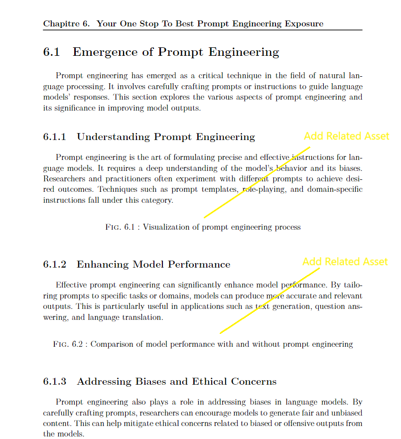

## 🤖Latex Success With GPT Prompt

This guide will walk you through the process of using the output from ChatGPT prompts in your LaTeX project.

- [Step 1: Generate Content with ChatGPT](#step-1-generate-content-with-chatgpt)
- [Step 2: Formatting the Content for LaTeX](#step-2-formatting-the-content-for-latex)
- [Step 3 : Preview and Compliation](#step-3--preview-and-compliation)


## Step 1: Generate Content with ChatGPT

1. Start by navigating to the following URL https://chat.openai.com/chat where you can access the ChatGPT platform.
2. Use the prompt I've crafted for you, simply change the designated section name.

[Prompt in Action](https://chat.openai.com/share/4fe9d0ca-b104-4eea-b904-9b0a6c7360d5)

```js
Below is a latex structure, I want you to refer to the section title  

Fill all required area (provide sub sections in the context) with REAL content

Make it very long and again in the same context.

For the figures, suggest an innovative caption only, for each, and i'll include the assets myself.

Feel Free to incorporate great table(s) If applicable to subsection(s) to mix the structure.

Also in the "Write.." spot, Aim for atleast 100 words long or more for each.
 
\section{⚠️Change This Only⚠️}
 Write..
\subsection{subsection}
\begin{figure}[hbt!]
 \centering
 \includegraphics[width=15cm]{image-path}
 \caption{suggest a title for asset of the section}
 \label{fig:two-opt}
\end{figure}
\FloatBarrier
\subsection{another subsection}
 Write..
\begin{figure}[hbt!]
 \centering
 \includegraphics[width=15cm]{image-path}
 \caption{suggest a title for asset of the section}
 \label{fig:two-opt}
\end{figure}
\FloatBarrier
\subsection{sub sub sect}
 Write..
\begin{figure}[hbt!]
 \centering
 \includegraphics[width=15cm]{image-path}
 \caption{suggest a title for asset of the section}
 \label{fig:two-opt}
\end{figure}
\FloatBarrier
\subsubsection{related}
 Write..
\begin{figure}[hbt!]
 \centering
 \includegraphics[width=15cm]{image-path}
 \caption{suggest a title for asset of the section}
 \label{fig:two-opt}
\end{figure}
\FloatBarrier
\subsubsection{Leave this title; Yaya Is Here For Magic}
 Write..
\begin{figure}[hbt!]
 \centering
 \includegraphics[width=15cm]{image-path}
 \caption{suggest a title for Yahya Abulhaj}
 \label{fig:two-opt}
\end{figure}
\FloatBarrier
\subsubsection{related}
 Write..
\begin{figure}[hbt!]
 \centering
 \includegraphics[width=15cm]{image-path}
 \caption{suggest a title for asset of the section}
 \label{fig:two-opt}
\end{figure}
\FloatBarrier
\subsubsection{related}
 Write..
\begin{figure}[hbt!]
 \centering
 \includegraphics[width=15cm]{image-path}
 \caption{suggest a title for asset of the section}
 \label{fig:two-opt}
\end{figure}
\FloatBarrier
\subsubsection{related}
\begin{figure}[hbt!]
 \centering
 \includegraphics[width=15cm]{image-path}
 \caption{suggest a title for asset of the section}
 \label{fig:two-opt}
\end{figure}
\FloatBarrier


Give the output in code snippet for easy copy paste.
```

## Step 2: Formatting the Content for LaTeX

1. I've presented you [my entire conversation history](https://chat.openai.com/share/2754c1e6-7c80-4199-96e6-73c3cbea7ebe) with the chat, leaving you no room for excuses but to get the job done.


I needed to remove these commands `\documentclass{article}`, `\usepackage{graphicx}`, `\usepackage{float}`, `\begin{document}`, `\end{document}` since they were already present on my page. 


2. Directly employ the content within the appropriate section and subsection.

```js
\section{Emergence of Prompt Engineering}
Prompt engineering has emerged as a critical technique in the field of natural language processing. It involves carefully crafting prompts or instructions to guide language models' responses. This section explores the various aspects of prompt engineering and its significance in improving model outputs.

\subsection{Understanding Prompt Engineering}
Prompt engineering is the art of formulating precise and effective instructions for language models. It requires a deep understanding of the model's behavior and its biases. Researchers and practitioners often experiment with different prompts to achieve desired outcomes. Techniques such as prompt templates, role-playing, and domain-specific instructions fall under this category.

\begin{figure}[hbt!]
 \centering
 \includegraphics[width=15cm]{image-path}
 \caption{Visualization of prompt engineering process}
 \label{fig:prompt-engineering}
\end{figure}
\FloatBarrier

\etc.. Complete File Provided Below.
```

3. I scrolled through the page and merged the content of the second prompt, ensuring it maintains the same context.

```js
\section{Will AI Take My Job?}
The rise of artificial intelligence (AI) has sparked discussions and concerns about its potential impact on the job market. This section delves into the complex topic of whether AI will replace human jobs and explores various perspectives and factors associated with this issue.

\subsection{Current State of AI in the Job Market}
As AI technologies continue to advance, they are being integrated into various industries and sectors. From manufacturing to customer service, AI-powered solutions are becoming more prevalent, automating tasks that were traditionally performed by humans.

\begin{figure}[hbt!]
 \centering
 \includegraphics[width=15cm]{image-path}
 \caption{Illustration of AI technologies in different industries}
 \label{fig:ai-industries}
\end{figure}
\FloatBarrier

\etc.. Complete File Provided Below.
```

> I feel like [I need more LaTeX, Yaya.](learntex.md).

## Step 3 : Preview and Compliation

Please open this using your LaTeX viewer, such as Overleaf, to observe and successfully compile your LaTeX project.

Excited to [See the final outcome](https://github.com/yaya2devops/bachelor-guide/blob/main/docs/images/latex/2-prompt-5-pages.pdf)?



| ☑️        |  You're not required to create a figure caption; I've already provided one for you in the prompt.      |
|:---------------|:------------------------:|


### Wrap Up!

In just under 5 minutes, using two prompts, we managed to generate a comprehensive 5-page LaTeX document, fully prepared for presentation to anyone interested. 

Quite astonishing, isn't it?

| :information_source: Recap        | Resources      |
|:---------------|:------------------------:|
|Yaya's GPT Latex Interaction| [Redirect](https://chat.openai.com/share/2754c1e6-7c80-4199-96e6-73c3cbea7ebe) |
|Output Merged Tex File|[Redirect](https://github.com/yaya2devops/bachelor-guide/blob/main/docs/images/latex/2-prompt-5-pages.tex)|
| 2 Prompt, 5  Pages Latex|[Redirect](https://github.com/yaya2devops/bachelor-guide/blob/main/docs/images/latex/2-prompt-5-pages.pdf)|

> Need templates for your work? [Check Students Initiative Section.](https://istic.computer-engineering.tech/?#/ISTIC_Materials)

### Next Steps

1. Add More Prompt, More content, More!

As you can see, we're unable to provide the images, for now, haha.

2.  Incorporate assets such as diagrams, architectures, and other into your project, and make sure to provide the precise path in the `image-path` field below.

```tex
\begin{figure}[hbt!]
 \centering
 \includegraphics[width=15cm]{image-path}
 \caption{Anticipating the future landscape of work with AI}
 \label{fig:future-work}
\end{figure}
\FloatBarrier
```

Creating a masterpiece and delivering it for your project has never been more effortless. 

So, [why wait any longer❓](https://drive.google.com/drive/folders/1OLvX6kEaIFk-8JgGyrW1E_Wl-5sx_zhP)


