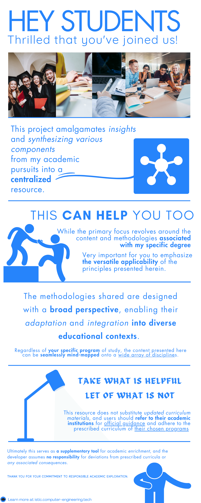

## The concept originated as a collection of thoughts, as many of my ideas do. 

### I then translated these thoughts into straightforward plain text.

```txt
This project amalgamates insights and synthesizing various components from my academic pursuits into a centralized resource. 

While the primary focus revolves around the content and methodologies associated with my specific degree, it is very important for you to emphasize the versatile applicability of the principles presented herein.

The methodologies shared are designed with a broad perspective, enabling their adaptation and integration into diverse educational contexts. 
Regardless of your specific program of study, the content presented here can be seamlessly mind-mapped onto a wide array of disciplines.

Take what is helpful,
Let what is not.

This resource does not substitute updated curriculum materials, and users should refer to their academic institutions for official guidance and adhere to the prescribed curriculum of their chosen programs. 

It serves as a supplementary tool for academic enrichment, and the developer assumes no responsibility for deviations from prescribed curricula or any associated consequences.

Thank you for your engagement, your understanding and commitment to responsible academic exploration.

Sincerely,
```


## I next visited Canva..
## And turned those into a great piece of work.



> Best,