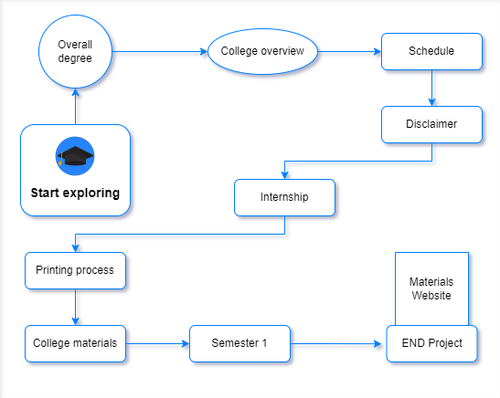

<br>
<br>

# [Guide to Computer Engineering ](https://istic.computer-engineering.tech/#/)

 Welcome to the guide for our bachelor's degree project, a project entirely driven by students with the goal of providing comprehensive and accessible learning materials.


As students ourselves, we understand the challenges that can come with starting a new learning journey. 

Very overwhelming to navigate through a sea of information, not knowing where to start or what materials are essential. 

We therefore decided to take on this project - to create a resource that would make it easier for anyone to begin their learning without confusion or a lack of information.

The following is the direction I designed for you so you fully abstract most of the concepts, terms, and methodologies required to ace your degree without requiring external validation or requests.



To be transparent, the project aims and after two years I'm confident to say that it reached the level to provide **instant access to knowledge.** 


We went through a very lengthy process, time and effort consuming with pure evidence to achieve these objectives, which never end till the end of the internet.

- You can view some of the events that occurred from [here](../inspirations.md).
- You can find the [older version](https://stale.computer-engineering.tech/#/) that may inspire you.

- You can check some assets of behind the scenes [here.](../behindascene/README.md)

Throughout the course of this project, again, we faced many pull backs since most students not into sharing their god-like materials for the sake of open source.

I had to explain the vision and the value earned. 

Despite all those that, we were able to make significant progress and provide a substantial amount of materials.

I also designed a structure that made it crystal clear for you. 

Some of the most significant results and findings of our project include a compress of value for all semesters in various format 

A plethora of hands-on lab instructions that students can follow.

I've wrote and traced those labs as well and can be found [here](https://labs.computer-engineering.tech/)

The rest of this website is organized into Semesters, subjects, chapters and Hands-on software. 

I also narrated some intense experiences as soon as I lived it.


We hope that by following that, you will be able to easily navigate through the information.


To abstract it with less pain and more ways through.

We love to see you win. 

You can now e.g. refer to the [sidebar](https://github.com/Y4HYA4/TheRealBachelorsDocs/blob/main/docs/_sidebar.md).

Or do whatever as everything you'll face will get you enlighten.

We are confident that our project will be a valuable resource for you.

We have no doubt in that. 


We'll keep doing it with these quotes in mind.
 
> “Share your knowledge. It is a way to achieve immortality.”  –Dalai Lama

> “Every addition to true knowledge is an addition to human power.” –Horace Mann


## [Contributing](https://istic.computer-engineering.tech/#/how-to-contribute)

There are two kinds of people, those who only consume and those who create for those who does just that.

I mean feel free, consume buddy. But think about it.

Add your own taste to this masterpiece.

What you got from your experiences that others can scale on?

That's what is this section for.

Continue to look through `docs`.


Attack those who you have things to add on.

[We think this is important.](../ISTIC_Materials.md#important-notice)

Whether you support or not, we'll help more students and YOU watch.


``` 

.BachelorsDocs
├──.vscode
├── Docs
│   ├── Semester1
│        ├── 1.md // Ex: If I wanted to contribute something to semester 1, I would edit this file.
│   ├── Semester2
│        ├── 2.md
│   ├── Semester3-IOT
│        ├── 3.md
│   ├── Semester3-IRS
│        ├── 3.md
│   ├── Semester4-IOT
│        ├── 4.md
│   ├── Semester4-IRS
│        ├── 4.md
│   ├── Semester5-IRS
│        ├── 5.md
│   ├── Semester5-IRS
│        ├── 5.md
├── node_modules
├── README.md
├── package-lock.json
├── package.json
```


## [Sharing Is Caring](https://forms.zohopublic.com/isticbc/form/Resources/formperma/1-4w1KAlQUkKxzvRsc2V688moUg8Ki1yM7fQVmrZpuQ?fbclid=IwAR1FDnq3LGfBSceGha03cWRwXUorw1WSEr_uuH7_egYI33ePVNUCJ0ylLJQ)


Your computer have something for others. Give it or hide it with this key 🔑


### Email Addresses:

- **Overall Issue:** improve@computer-engineering.tech
- **IOT Related:** yahya@computer-engineering.tech
- **Networking Related:** jawher.smida@computer-engineering.tech

There above are open emails as well, we always looking to what you have to say.
